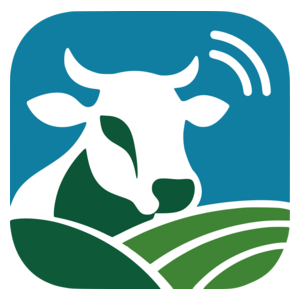
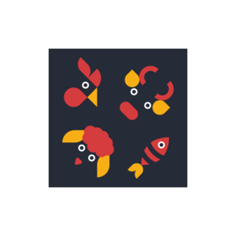
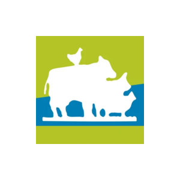

# Capítulo II: Requirements Development and Software Solution Design

## 2.1. Competidores

Comprender el entorno competitivo nos permite reconocer las alternativas disponibles para los usuarios y determinar cómo puede diferenciarse ANITEC para alcanzar el éxito como negocio. Por eso en esta sección se van a comparar tres aplicaciones relacionadas con la gestión ganadera: Livestock Manager, Herdwatch y AgriWebb. Se analizarán sus funciones, usuarios, estrategias de marketing, precios, canales de distribución, fortalezas y debilidades.

## 2.1.1. Análisis competitivo

El análisis competitivo permite conocer cómo otras aplicaciones móviles atienden la gestión y el seguimiento sanitario del ganado. Esta comparación ayudará a identificar oportunidades y riesgos, además de reconocer las características que ANITEC debe priorizar para ofrecer una propuesta diferenciada a ganaderos y veterinarios.

<html>
<body>
<table>
    <tr>
        <td colspan="6" class="sub"><h1>Competitive Analysis Landscape</h1></td>
    </tr>
    <tr>
        <td colspan="2" rowspan="2" class="sub">¿Por qué llevar a cabo este análisis?</td>
        <td colspan="4" class="sub"><h3>¿Quiénes son nuestros principales competidores?</h3></td>
    </tr>
    <tr>
        <td colspan="4">El análisis permite conocer cómo las aplicaciones competidoras organizan la información ganadera, qué funciones ofrecen, a qué usuarios se dirigen y cuáles son sus modelos de precios. De esta manera, se pueden reconocer las características que ANITEC debe priorizar para diferenciarse.</td>
    </tr>
    <tr>
        <td rowspan="3" class="sub">PERFIL</td>
        <td rowspan="2" class="sub">Overview</td>
        <td>
            <strong>ANITEC</strong> 
                
        </td>
        <td>
            <strong>Livestock Manager</strong> 
            
        </td>
        <td>
            <strong>Herdwatch</strong> 
            
        </td>
        <td>
            <strong>AgriWebb</strong> 
            
        </td>
    </tr>
    <tr>
        <td>Aplicación móvil dirigida a pequeños y medianos ganaderos y veterinarios. Centraliza la información de los animales y facilita la coordinación de visitas, atenciones y seguimientos sanitarios mediante perfiles diferenciados.</td>
        <td>Aplicación móvil y plataforma web para administrar distintas especies de animales. Permite registrar información de salud, alimentación, reproducción, producción y finanzas.</td>
        <td>Aplicación móvil y web para registrar animales, tratamientos, reproducción y rendimiento. Puede utilizarse sin conexión y sincronizar la información posteriormente.</td>
        <td>Aplicación móvil y web que reúne información de animales, tratamientos, inventario, mapas, pastoreo, tareas y cumplimiento. Su aplicación móvil funciona sin conexión.</td>
    </tr>
    <tr>
        <td class="sub">Ventaja competitiva: ¿qué valor ofrece a sus clientes?</td>
        <td>Vinculación autorizada entre ganaderos y veterinarios. Ambos pueden consultar los antecedentes sanitarios del animal y mantener la continuidad de sus atenciones, tratamientos e indicaciones.</td>
        <td>Permite gestionar varias especies desde dispositivos móviles y computadoras. También cuenta con un plan gratuito y reúne registros sanitarios, productivos y financieros.</td>
        <td>Combina el registro pecuario con el funcionamiento sin conexión. Además, se integra con servicios oficiales para facilitar los registros de cumplimiento.</td>
        <td>Integra registros, mapas, pastoreo, tareas y análisis en una sola plataforma. También permite administrar equipos mediante usuarios y permisos.</td>
    </tr>
    <tr>
        <td rowspan="2" class="sub">PERFIL DE MARKETING</td>
        <td class="sub">Mercado objetivo</td>
        <td>Pequeños y medianos ganaderos que necesitan organizar la información sanitaria de sus animales, y veterinarios que realizan visitas, atenciones y seguimientos en campo.</td>
        <td>Propietarios, productores y empresas que administran ganado bovino, ovino, caprino, porcino, aves, peces y otras especies.</td>
        <td>Productores pequeños y grandes que gestionan ganado bovino, ovino, pasturas y registros de reproducción, rendimiento y cumplimiento.</td>
        <td>Productores y empresas pecuarias que necesitan gestionar animales, equipos de trabajo, pastoreo y registros productivos.</td>
    </tr>
    <tr>
        <td class="sub">Estrategias de marketing</td>
        <td>Landing page informativa para presentar las funciones y beneficios de ANITEC. La propuesta será validada mediante entrevistas con ganaderos y veterinarios antes de definir nuevas estrategias.</td>
        <td>Promueve su plan gratuito, la disponibilidad móvil y web, los testimonios de usuarios y la descarga mediante tiendas de aplicaciones.</td>
        <td>Ofrece un plan gratuito, promociones de suscripción, prueba de funciones completas, demostraciones, testimonios y webinars.</td>
        <td>Promueve una prueba gratuita y una demostración interactiva. También publica historias de clientes, guías y noticias del producto.</td>
    </tr>
    <tr>
        <td rowspan="3" class="sub">PERFIL DEL PRODUCTO</td>
        <td class="sub">Productos y servicios</td>
        <td>Registro y consulta de animales, antecedentes sanitarios, vinculación entre ganaderos y veterinarios, coordinación de visitas y controles, registro de atenciones, tratamientos, vacunas e indicaciones, gestión de cuentas, suscripciones y notificaciones.</td>
        <td>Gestión de animales, salud, medicamentos, alimentación, reproducción, producción, gastos, ingresos, reportes, facturación y colaboración entre usuarios.</td>
        <td>Registro de animales, tratamientos, reproducción, rendimiento, pasturas, mapas y cumplimiento. También permite importar información del hato.</td>
        <td>Gestión de animales, tratamientos, peso, alimentación, reproducción, inventario, mapas, pastoreo, tareas y reportes.</td>
    </tr>
    <tr>
        <td class="sub">Precios y costos</td>
        <td>Se contempla un plan gratuito y beneficios premium. Los precios, límites y funciones de cada plan todavía no han sido definidos.</td>
        <td>Starter: USD 0. Growth: USD 3.99 al mes. Scale: USD 9.99 al mes. Growth y Scale se facturan anualmente. Enterprise: precio mediante cotización.</td>
        <td>Digital Calving Book: USD 0 al año. PRO: USD 49 por los primeros 6 meses y luego USD 20 mensuales.</td>
        <td>Planes Essentials, Compliance y Performance. El precio se calcula según la región y la cantidad de bovinos u ovinos administrados.</td>
    </tr>
    <tr>
        <td class="sub">Canales de distribución (web/móvil)</td>
        <td>Aplicación móvil nativa y multiplataforma para ganaderos y veterinarios. La propuesta se complementa con una landing page estática para presentar el producto.</td>
        <td>Aplicación móvil y plataforma web, promocionadas mediante su sitio oficial y tiendas de aplicaciones.</td>
        <td>Aplicación para iOS y Android, además de acceso desde computadoras. Puede utilizarse sin conexión.</td>
        <td>Aplicación para iOS y Android, además de una plataforma web. La aplicación móvil funciona sin conexión.</td>
    </tr>
    <tr>
        <td rowspan="4" class="sub">ANÁLISIS SWOT</td>
        <td class="sub">Fortalezas</td>
        <td>Perfiles diferenciados para ganaderos y veterinarios. La vinculación autorizada, los antecedentes sanitarios y el registro de atenciones permiten mantener la continuidad del seguimiento de cada animal.</td>
        <td>Dispone de aplicación móvil, plataforma web y plan gratuito. También permite gestionar diferentes especies y tipos de registros.</td>
        <td>Funciona sin conexión y ofrece registros orientados al cumplimiento. También se integra con servicios oficiales.</td>
        <td>Cubre diversos procesos ganaderos e incluye mapas, análisis, funcionamiento sin conexión y gestión de equipos.</td>
    </tr>
    <tr>
        <td class="sub">Debilidades</td>
        <td>ANITEC todavía se encuentra en desarrollo. Sus precios, límites de planes y estrategias de marketing no están definidos, y aún debe validar su propuesta con los usuarios objetivo.</td>
        <td>Abarca diferentes especies y procesos, pero no presenta un perfil veterinario diferenciado ni una vinculación similar a la propuesta por ANITEC.</td>
        <td>Sus principales integraciones de cumplimiento están orientadas a determinados países. Además, algunas tarifas dependen del tamaño y tipo de explotación.</td>
        <td>Su amplia cantidad de funciones puede resultar compleja para productores que solo necesitan organizar el seguimiento sanitario.</td>
    </tr>
    <tr>
        <td class="sub">Oportunidades</td>
        <td>Puede atender a ganaderos y veterinarios que necesitan compartir información sanitaria y continuar el seguimiento de las atenciones dentro de una misma aplicación móvil.</td>
        <td>Puede incorporar procesos específicos de colaboración entre propietarios y veterinarios para las distintas especies que administra.</td>
        <td>Puede extender sus integraciones de cumplimiento a otros países y desarrollar una colaboración más directa con veterinarios.</td>
        <td>Puede adaptar sus herramientas a productores pequeños e incorporar procesos específicos de seguimiento veterinario.</td>
    </tr>
    <tr>
        <td class="sub">Amenazas</td>
        <td>Compite con aplicaciones consolidadas que cuentan con más funciones, trabajo sin conexión, presencia en tiendas y una base de usuarios existente.</td>
        <td>Las aplicaciones especializadas en una sola especie o actividad pueden ofrecer una experiencia más específica para algunos productores.</td>
        <td>Las diferencias regulatorias entre países pueden limitar la utilidad de sus integraciones fuera de los mercados para los que fueron desarrolladas.</td>
        <td>Las aplicaciones especializadas pueden resultar más sencillas para los usuarios que no necesitan una plataforma integral.</td>
    </tr>
</table>
</body>
</html>

El análisis muestra que los tres competidores ofrecen aplicaciones móviles para registrar y administrar información pecuaria. Livestock Manager permite gestionar diferentes especies y cuenta con un plan gratuito; Herdwatch destaca por su funcionamiento sin conexión y sus herramientas de cumplimiento; mientras que AgriWebb reúne una mayor variedad de procesos productivos y de gestión. Frente a estas aplicaciones, ANITEC busca diferenciarse mediante la vinculación directa entre ganaderos y veterinarios, la consulta compartida de antecedentes sanitarios y la continuidad del seguimiento de cada animal.

## 2.1.2. Estrategias y tácticas frente a competidores

A partir de la comparación realizada, ANITEC deberá concentrar su propuesta inicial en las funciones que responden directamente a las necesidades de sus dos segmentos objetivo. Estas estrategias y tácticas son preliminares y podrán actualizarse después de realizar las entrevistas.

### Estrategias preliminares

- Diferenciar la propuesta mediante la vinculación autorizada entre ganaderos y veterinarios, sin competir inicialmente por la cantidad de módulos.
- Priorizar los antecedentes sanitarios, atenciones, tratamientos, vacunas e indicaciones como funciones principales.
- Mantener una aplicación móvil con flujos claros y responsabilidades diferenciadas para cada tipo de usuario.
- Adaptar la propuesta a las necesidades identificadas durante las entrevistas con ganaderos y veterinarios.
- Definir los planes, límites y precios después de validar las necesidades y capacidades de pago de los usuarios.

### Tácticas preliminares

- Utilizar la landing page para explicar las funciones de ANITEC y la relación entre ganaderos, veterinarios y animales.
- Presentar un recorrido que muestre la vinculación, la consulta de antecedentes y el registro de una atención veterinaria.
- Recoger las observaciones de ambos segmentos mediante entrevistas y utilizarlas para revisar la propuesta.
- Priorizar el seguimiento sanitario antes de incorporar módulos productivos adicionales.
- Comunicar claramente las funciones incluidas en cada plan cuando sus límites y precios sean definidos.
