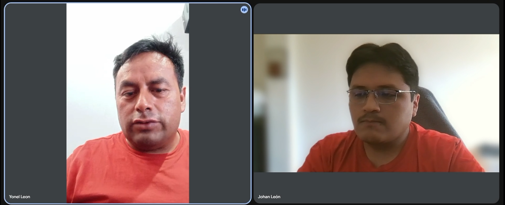
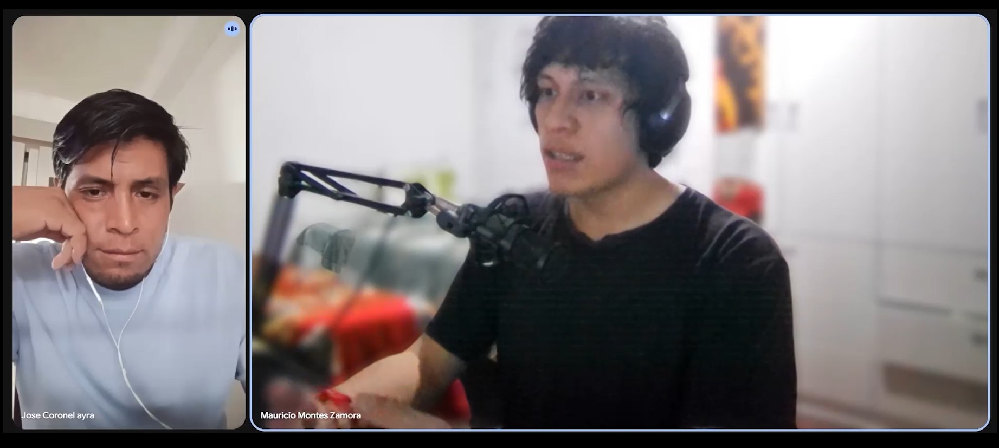
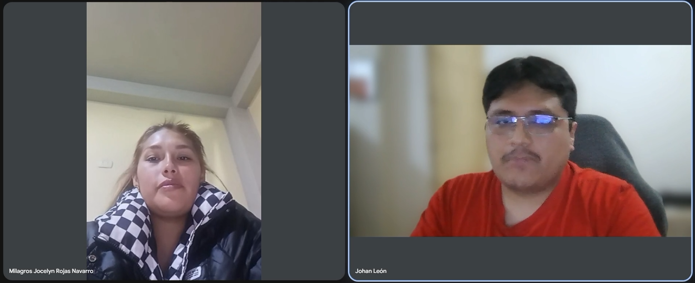

# 2.2. Entrevistas

## 2.2.1. Diseño de entrevistas

Las entrevistas buscan comprender cómo los ganaderos organizan
la información y el cuidado de sus animales, y cómo los veterinarios
registran sus atenciones y realizan el seguimiento de sus pacientes.

### Segmento objetivo 1: Ganaderos

1. **Cuéntenos sobre su trabajo: ¿qué ganado maneja, cuántos animales tiene aproximadamente y quiénes participan en su cuidado?**

2. **¿Cómo identifica a sus animales y organiza la información de cada uno?**

   _Para profundizar:_ ¿Cómo encuentra los antecedentes de un animal cuando los necesita?

3. **Cuéntenos una dificultad reciente al organizar el cuidado de su ganado. ¿Qué pasó y cómo la resolvió?**

   _Para profundizar:_ ¿Qué consecuencias tuvo?

4. **Piense en la última atención veterinaria que recibió uno de sus animales. ¿Cómo se organizó todo, desde que buscó ayuda hasta que recibió las indicaciones?**

5. **Después de esa atención, ¿cómo organizaron los cuidados y comunicaron al veterinario la evolución del animal?**

   _Para profundizar:_ ¿Cómo sabían qué se había realizado y qué faltaba?

6. **¿Cómo se da cuenta de que un animal necesita atención cuando no está observándolo directamente?**

   _Para profundizar:_ ¿Qué personas, equipos o registros le ayudan?

7. **¿Cómo utiliza el celular en su trabajo y qué dificultades encuentra para usarlo en el campo?**

   _Para profundizar:_ ¿Cómo influyen la conexión a internet, la facilidad de uso o el tiempo disponible?

8. **De todo lo que nos contó, ¿qué le gustaría resolver primero y qué cambiaría en su trabajo si lo lograra?**

### Segmento objetivo 2: Veterinarios

1. **Cuéntenos sobre su experiencia atendiendo ganado y cómo organiza sus visitas entre los distintos ganaderos con los que trabaja.**

2. **Descríbanos una atención reciente, desde que recibió la solicitud hasta que terminó de atender al animal.**

   _Para profundizar:_ ¿Qué información necesitó durante ese proceso?

3. **¿Cómo consulta y actualiza los antecedentes de un animal que ya fue atendido anteriormente?**

   _Para profundizar:_ ¿Qué ocurre si lo atendió otro profesional?

4. **¿Cómo realiza el seguimiento después de dejar indicaciones al ganadero?**

   _Para profundizar:_ ¿Cómo sabe qué actividades se realizaron y qué pacientes necesitan otra revisión?

5. **Cuéntenos una ocasión en la que tuvo dificultades para obtener o registrar información de un paciente. ¿Cómo lo resolvió?**

   _Si no le ha ocurrido:_ ¿Qué le funciona para evitar esas dificultades?

6. **Entre una visita y otra, ¿qué información sobre la evolución del animal necesita y cómo la obtiene?**

   _Para profundizar:_ ¿Utiliza observaciones del ganadero, fotografías o mediciones de algún equipo?

7. **¿Cómo utiliza el celular durante las visitas y qué hace cuando la conexión es limitada?**

8. **¿Qué parte de la organización de sus atenciones le genera más dificultades y qué cambiaría si pudiera resolverla?**

## 2.2.2. Registro de entrevistas

**Segmento 1: Pequeños y medianos ganaderos**

#### Entrevista 01

_Evidencia de entrevista: Yonel León._

- **Nombre:** Yonel León.
- **Edad:** 42 años.
- **Distrito de residencia:** Localidad de Huanta - Ayacucho.
- **Fecha de la entrevista:** 9 de octubre de 2026.
- **Entrevistador:** Johan León.
- **Enlace de la entrevista:** [Ver grabación aquí][grabacion-yonel-leon].
- **Duración:** 08:42.
- **Timing:** 00:00 – 08:42.

**Resumen de la entrevista:**

La entrevista a Yonel León, dedicado a la crianza familiar de aproximadamente 40 vacunos, evidencia que la administración de los animales y el seguimiento de sus cuidados se realizan principalmente mediante anotaciones manuales. El entrevistado señala que una de las principales dificultades es identificar y separar correctamente entre 10 y 15 becerros de distintas edades, sobre todo durante los periodos de lactancia. Para organizar la información, su familia utiliza un cuadernillo en el que registra las fechas de nacimiento, el destete, las vacunaciones y los antecedentes sanitarios de cada animal. Asimismo, indica que la detección inicial de enfermedades se basa en la observación de síntomas como falta de apetito, pérdida de peso o diarrea, cuando identifican un vacuno enfermo, lo separan del resto y solicitan la evaluación y el seguimiento de un veterinario.

El entrevistado también explica que llevan anotaciones sobre la alimentación diaria, incluyendo alimento balanceado, forraje y chala, lo cual permite que otros integrantes de la familia continúen las labores cuando alguno se ausenta. En relación con la tecnología, menciona que disponen de señal de telefonía celular, pero que el acceso a internet en la zona es limitado o no está disponible. Finalmente, expresa su interés en mejorar las instalaciones de su actividad ganadera y utilizar un sistema digital desde el celular para optimizar el registro de información. Sus respuestas ponen de manifiesto necesidades relacionadas con la identificación de animales, la organización de historiales sanitarios y la consulta de registros en entornos con dificultades de conectividad, aspectos relevantes para el desarrollo de ANITEC.

[grabacion-yonel-leon]: https://upcedupe-my.sharepoint.com/:v:/g/personal/u20231h055_upc_edu_pe/IQAKIxhAf5_LQLDUlG-YJzDdAbYjVoga6cs0K4chDpz9Ql8?nav=eyJyZWZlcnJhbEluZm8iOnsicmVmZXJyYWxBcHAiOiJPbmVEcml2ZUZvckJ1c2luZXNzIiwicmVmZXJyYWxBcHBQbGF0Zm9ybSI6IldlYiIsInJlZmVycmFsTW9kZSI6InZpZXciLCJyZWZlcnJhbFZpZXciOiJNeUZpbGVzTGlua0NvcHkifX0&e=TObKPc

#### Entrevista 02

_Evidencia de entrevista: Jose Cirineo._

- **Nombre:** Jose Cirineo.
- **Edad:** 37 años.
- **Distrito de residencia:** Localidad de Quiparacra - Pasco.
- **Fecha de la entrevista:** 6 de octubre de 2026.
- **Entrevistador:** Mauricio Montes.
- **Enlace de la entrevista:** [Ver grabación aquí][grabacion-yonel-leon].
- **Duración:** 08:19.
- **Timing:** 00:00 – 08:19.

**Resumen de la entrevista:**

La entrevista a José Cirineo (37 años), dedicado a la crianza familiar de un hato aproximado de entre 80 y 100 vacunos en la ciudad de Oxapampa (Pasco), evidencia que la organización y seguimiento de sus animales se realiza mediante la asignación de un código desde el día de su nacimiento y el uso de nombres individuales para su verificación constante a lo largo del tiempo. El entrevistado señala que las principales dificultades en el cuidado del ganado se deben a las condiciones climáticas, al cambio de estación y, en menor medida, a enfermedades, factores que en ocasiones pueden ocasionar la pérdida o fallecimiento de los animales.

En cuanto a la gestión de la salud, José indica que la detección inicial de enfermedades o problemas se realiza de manera presencial en el pastal o granja, debido a que no disponen de un sistema o alertas automáticas que les avisen a distancia cuando un animal requiere atención. Al identificar un caso, evalúan la situación y contactan por teléfono celular a su veterinario de confianza para recibir las indicaciones y medicamentos adecuados. Posterior a la atención, la familia mantiene una vigilancia diaria e informa periódicamente al especialista sobre la evolución del tratamiento para confirmar si el vacuno mejora o empeora.

Asimismo, el teléfono celular resulta indispensable en su labor cotidiana para coordinar con el veterinario, conectarse con proveedores y realizar las operaciones de compra y venta de ganado. Sin embargo, la comunicación en el campo se ve obstaculizada por la falta o irregularidad de la señal celular e internet en diversas zonas rurales. Finalmente, expresa su deseo de acceder a mayor información y a un manejo profesional más avanzado que le permita progresar y generar mayores beneficios para su actividad ganadera. Sus respuestas ponen de manifiesto necesidades asociadas al monitoreo y registro del ganado, la gestión de alertas sanitarias y la disponibilidad de herramientas digitales adaptadas a zonas con baja conectividad.

[grabacion-jose-cirineo]: https://upcedupe-my.sharepoint.com/personal/u20241e126_upc_edu_pe/_layouts/15/stream.aspx?id=%2Fpersonal%2Fu20241e126%5Fupc%5Fedu%5Fpe%2FDocuments%2FAplicaciones%20Moviles%2FEntrvista%20Jose%20Cirineo%20Ayra%2Em4v&ga=1

**Segmento 2: Veterinarios**

#### Entrevista 01

_Evidencia de entrevista: Milagros Jocelyn Rojas Navarro._

- **Nombre:** Milagros Jocelyn Rojas Navarro.
- **Edad:** 27.
- **Distrito de residencia:** Localidad de Huanta - Ayacucho.
- **Fecha de la entrevista:** 9 de octubre de 2026.
- **Entrevistador:** Johan León.
- **Enlace de la entrevista:** [Ver grabación aquí][grabacion-milagros-rojas].
- **Duración:** 04:03.
- **Timing:** 00:00 – 04:03.

**Resumen de la entrevista:**

La entrevista a Milagros Jocelyn Rojas Navarro, veterinaria que atiende ganado vacuno y caprino en comunidades de la sierra, permite conocer cómo organiza sus visitas y administra la información clínica de los animales. La entrevistada explica que programa sus desplazamientos considerando la urgencia del caso, la distancia y las necesidades de los ganaderos. Como ejemplo, describe la atención a una vaca que presentaba falta de apetito y debilidad, para la cual recopiló información sobre los síntomas, la alimentación y los antecedentes antes de determinar el tratamiento. Asimismo, señala que registra los síntomas, diagnósticos y tratamientos en un cuaderno. Cuando un animal fue atendido previamente por otro profesional, consulta al ganadero acerca de los medicamentos y cuidados recibidos, si no recuerda estos datos, recurre a las recetas o los envases disponibles para reconstruir la información.

Respecto al seguimiento, la entrevistada indica que verifica la evolución de los animales mediante llamadas telefónicas o nuevas visitas, preguntando si presentan fiebre, si comen adecuadamente y si han mejorado. También solicita fotografías cuando existe señal telefónica. Sin embargo, menciona que la conectividad limitada o inexistente dificulta la comunicación y la actualización inmediata de los registros, por lo que continúa anotando la información en un cuaderno para incorporarla después. Entre sus principales dificultades identifica las largas distancias entre comunidades y la falta de señal. Por ello, expresa interés en mejorar la organización de las visitas y disponer de registros digitales que funcionen sin conexión a internet. Esta información resulta relevante para ANITEC, especialmente en la gestión de historiales veterinarios, el seguimiento de tratamientos y el acceso a datos en zonas con conectividad restringida.

[grabacion-milagros-rojas]: https://upcedupe-my.sharepoint.com/:v:/g/personal/u20231h055_upc_edu_pe/IQCTZixT3Q0FSogOFTN7434DAXNN0R4YOHJ5Y6T7frECdhw?nav=eyJyZWZlcnJhbEluZm8iOnsicmVmZXJyYWxBcHAiOiJPbmVEcml2ZUZvckJ1c2luZXNzIiwicmVmZXJyYWxBcHBQbGF0Zm9ybSI6IldlYiIsInJlZmVycmFsTW9kZSI6InZpZXciLCJyZWZlcnJhbFZpZXciOiJNeUZpbGVzTGlua0NvcHkifX0&e=RsGsaT

### 2.2.3 Análisis de entrevistas

Se analizaron dos entrevistas, una por segmento objetivo. Las frecuencias y porcentajes corresponden únicamente a los participantes entrevistados (**n = 1 por segmento**) y permiten identificar características iniciales para los arquetipos de ANITEC.

#### Segmento 1: Pequeños y medianos ganaderos

**Cuadro 1. Características identificadas en la entrevista a Yonel León**

| Tipo      | Característica                       | Sustento de la entrevista                                                | Frecuencia | Porcentaje |
| --------- | ------------------------------------ | ------------------------------------------------------------------------ | ---------- | ---------- |
| Objetiva  | Manejo familiar de ganado            | Administra aproximadamente 40 vacunos.                                   | 1/1        | 100 %      |
| Objetiva  | Registros manuales                   | Utiliza un cuadernillo para nacimientos, destete y controles sanitarios. | 1/1        | 100 %      |
| Objetiva  | Acceso limitado a internet           | Cuenta con señal telefónica, pero no con acceso utilizable a internet.   | 1/1        | 100 %      |
| Subjetiva | Dificultad para identificar becerros | Señala confusiones al manejar entre 10 y 15 becerros.                    | 1/1        | 100 %      |
| Subjetiva | Interés en la digitalización         | Desea utilizar un sistema digital para organizar sus registros.          | 1/1        | 100 %      |

_Fuente: entrevista a Yonel León, registrada en el apartado 2.2.2._

Estos resultados orientan el arquetipo hacia un ganadero que necesita identificar a sus animales y consultar su información sanitaria, incluso con conectividad limitada.

#### Segmento 2: Veterinarios

**Cuadro 2. Características identificadas en la entrevista a Milagros Jocelyn Rojas Navarro**

| Tipo      | Característica                    | Sustento de la entrevista                                                        | Frecuencia | Porcentaje |
| --------- | --------------------------------- | -------------------------------------------------------------------------------- | ---------- | ---------- |
| Objetiva  | Atención en comunidades           | Atiende ganado vacuno y caprino y organiza visitas según urgencia y distancia.   | 1/1        | 100 %      |
| Objetiva  | Registros clínicos manuales       | Anota síntomas, diagnósticos y tratamientos en un cuaderno.                      | 1/1        | 100 %      |
| Objetiva  | Seguimiento de pacientes          | Se comunica mediante llamadas, fotografías o nuevas visitas.                     | 1/1        | 100 %      |
| Subjetiva | Dificultades logísticas           | Identifica las largas distancias y la falta de señal como problemas principales. | 1/1        | 100 %      |
| Subjetiva | Interés en herramientas digitales | Desea organizar mejor sus visitas y utilizar registros sin internet.             | 1/1        | 100 %      |

_Fuente: entrevista a Milagros Jocelyn Rojas Navarro, registrada en el apartado 2.2.2._

El arquetipo preliminar corresponde a una veterinaria que necesita gestionar sus visitas, consultar historiales y hacer seguimiento de tratamientos cuando la conectividad es limitada.

**Conclusión general:** En las dos entrevistas (**2/2, 100 %**) se identificaron registros manuales, problemas de conectividad e interés en soluciones digitales. Estos hallazgos son preliminares y deberán contrastarse con más entrevistas antes de generalizarlos a cada segmento.

