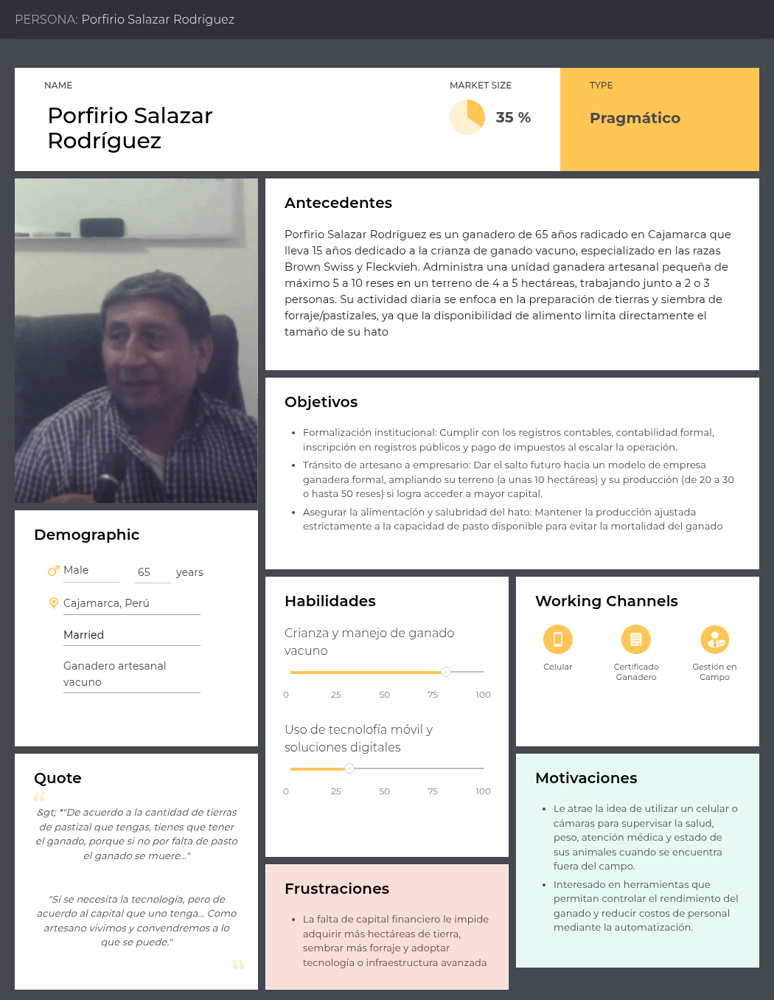
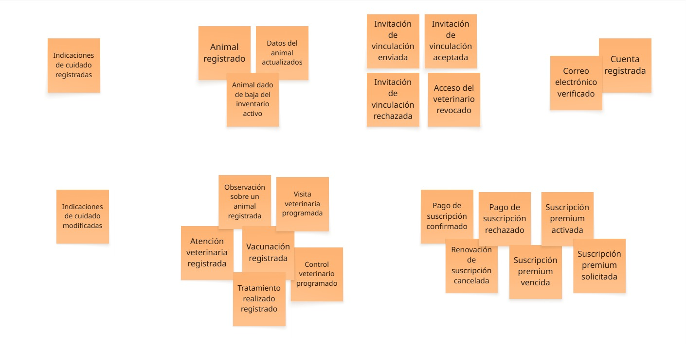
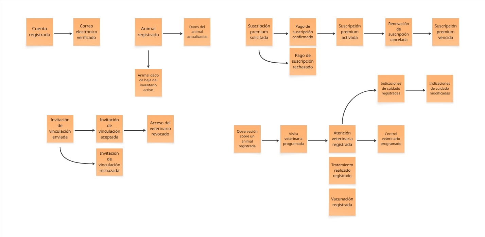
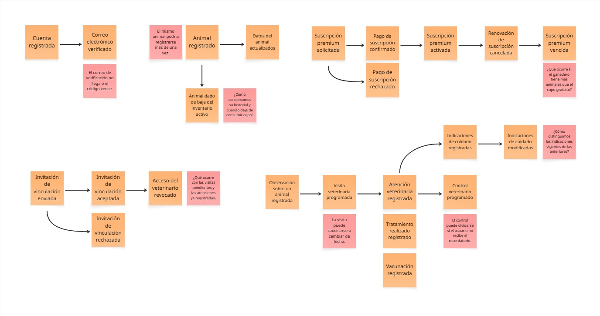
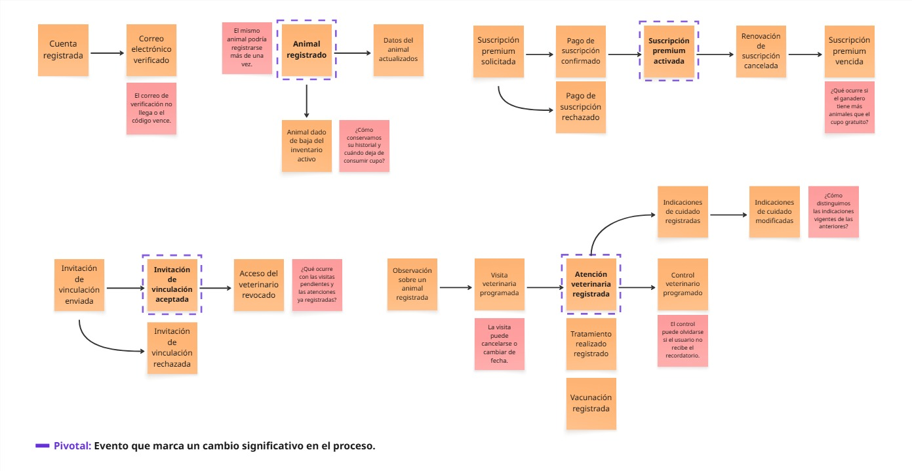

### 2.3.1. User Personas
**Segmento 1: Ganaderos**

### 2.3.2. User Task Matrix
**Segmento 1: Ganaderos**

<table>
  <thead>
    <tr>
      <th rowspan="2">Task</th>
      <th colspan="2">Porfirio Salazar Rodríguez</th>
    </tr>
    <tr>
      <th>Frequency</th>
      <th>Importance</th>
    </tr>
  </thead>
  <tbody>
    <tr>
      <td>Supervisar el estado general de los animales</td>
      <td>Alta</td>
      <td>Alta</td>
    </tr>
    <tr>
      <td>Revisar la alimentación y el cuidado diario del ganado</td>
      <td>Alta</td>
      <td>Alta</td>
    </tr>
    <tr>
      <td>Identificar posibles problemas de salud en los animales</td>
      <td>Alta</td>
      <td>Alta</td>
    </tr>
    <tr>
      <td>Consultar los antecedentes sanitarios de cada animal</td>
      <td>Media</td>
      <td>Alta</td>
    </tr>
    <tr>
      <td>Coordinar atenciones con un veterinario</td>
      <td>Media</td>
      <td>Alta</td>
    </tr>
    <tr>
      <td>Dar seguimiento a tratamientos e indicaciones veterinarias</td>
      <td>Media</td>
      <td>Alta</td>
    </tr>
    <tr>
      <td>Controlar vacunas y cuidados pendientes de los animales</td>
      <td>Media</td>
      <td>Alta</td>
    </tr>
  </tbody>
</table>

### 2.3.3. User Journey Mapping
**Segmento 1: Ganaderos**

### 2.3.4. Empathy Mapping
**Segmento 1: Ganaderos**

### 2.3.5. Big Picture EventStorming

El Big Picture EventSotrming nos permitio representar los pincipales acontecimientos de ANITEC y comprender las relaciones entre la gestión del ganado, la vinculación con veterinarios, las atenciones presenciales y las suscripciones. El modelado se desarrolló progresivamente mediante la exploración de eventos, su organización temporal, la identificación de dificultades y la selección de eventos. Todo este proceso se desarrollo en la plataforma Miro. [Ver Tablero](https://miro.com/welcomeonboard/MGhKZFJHcWZRaDA1VEhPeGVueUZlS2V2TUVJZnhVZUk0Rkx3TjVYWExHckNCclZmSisyaVZSN2M4SjNVdnRROFdSV21YNENhb2hQdkNBb0RHNkV1dVJvbnFnQU8rTlpiUVBxaGNNSE5WZzhnQ3BZYTBVWGtDejhNWUUxQW5xQ1lBS2NFMDFkcUNFSnM0d3FEN050ekl3PT0hdjE=?share_link_id=603558770825)

#### Exploración sin estructura

En esta primera etapa se identificaron acontecimientos relevantes para ANITEC, representados mediante notas naranjas y redactados en pasado. Se incluyeron eventos relacionados con las cuentas, el registro de animales, las invitaciones de vinculación, las atenciones veterinarias y las suscripciones. Su distribución inicial permitió explorar el alcance del proyecto sin establecer todavía una secuencia temporal ni límites definitivos entre sus procesos.

#### Lineas de tiempo

Los eventos se organizaron en secuencias para mostrar el desarrollo de los principales procesos y sus alternativas, como la aceptación o el rechazo de una invitación y la confirmación o el rechazo de un pago. En la atención veterinaria se relacionaron las observaciones del ganadero, la programación de una visita, el registro de la atención y la posible programación de controles posteriores.

Las flechas representan recorridos posibles y no implican que todos los pasos sean obligatorios o automáticos. Una observación puede motivar una visita, pero esta requiere coordinación. Los tratamientos y las vacunaciones son registros opcionales de una atención. Asimismo, revocar una vinculación o cancelar la renovación de una suscripción corresponde a decisiones posteriores, no a resultados obligatorios del proceso.

La cancelación de la renovación mantiene los beneficios premium hasta finalizar el período pagado. Por otro lado, programar un control no significa que este ya se haya realizado: cuando ocurre, se registra una nueva atención veterinaria. Este ciclo puede repetirse y se omite gráficamente para facilitar la lectura.

#### Pain Points

Sobre las secuencias se incorporaron notas rojas para señalar riesgos y preguntas surgidas durante el modelado. Entre ellas se encuentran los posibles registros duplicados de animales, las dificultades con la verificación del correo, la conservación del historial al dar de baja un animal y el tratamiento de los registros cuando vence una suscripción premium.

También se identificaron dudas sobre la revocación del acceso veterinario, la cancelación o reprogramación de visitas, la distinción entre indicaciones vigentes y anteriores, y el posible olvido de controles. Estas notas representan aspectos que requieren validación o definición de reglas de negocio; no constituyen, por sí mismas, problemas comprobados mediante entrevistas.

#### Pivotal Events

Finalmente, se destacaron cuatro eventos mediante bordes morados discontinuos, debido a los cambios significativos que representan dentro de los procesos:

- **Animal registrado:** incorpora un animal al inventario y permite asociarle información y registros posteriores.
- **Invitación de vinculación aceptada:** establece la relación autorizada entre el ganadero y el veterinario.
- **Atención veterinaria registrada:** deja constancia de una atención realizada y sirve como referencia para sus indicaciones y seguimiento.
- **Suscripción premium activada:** habilita los beneficios y el límite de animales correspondientes al plan contratado.

Estos eventos permiten reconocer momentos clave del negocio y sirven como referencia para profundizar posteriormente en las responsabilidades y relaciones del modelo.

#### 2.3.6. Ubiquitous Language

El lenguaje ubicuo de ANITEC establece un vocabulario común para los requerimientos, los diagramas y la implementación. Los términos se presentan en inglés, con su equivalente en español y una definición según el contexto al que pertenecen.

##### Identidad y acceso - Identity and Access Bounded Context

| Término                                    | Definición                                                                                            |
| ------------------------------------------ | ----------------------------------------------------------------------------------------------------- |
| Account (Cuenta)                           | Registro que identifica a un usuario de ANITEC y permite gestionar su acceso.                         |
| User Role (Perfil de usuario)              | Rol de ganadero o veterinario que determina las funciones y los planes aplicables al usuario.         |
| Verified Email (Correo verificado)         | Dirección de correo cuyo acceso por parte del usuario se comprobó mediante un código de verificación. |
| Verification Code (Código de verificación) | Código temporal asociado a una cuenta que permite comprobar el acceso al correo registrado.           |

##### Gestión del ganado - Livestock Management Bounded Context

| Término                                                | Definición                                                                                                    |
| ------------------------------------------------------ | ------------------------------------------------------------------------------------------------------------- |
| Livestock Owner (Ganadero)                             | Usuario que administra sus animales, registra observaciones y autoriza el acceso de veterinarios.             |
| Animal (Animal)                                        | Individuo del ganado registrado en el inventario de un ganadero.                                              |
| Active Animal (Animal activo)                          | Animal que permanece en el inventario activo y cuenta para el límite permitido por el plan.                   |
| Inventory Capacity (Capacidad del inventario)          | Cantidad máxima de animales activos permitida para un ganadero según su plan vigente.                         |
| Inventory Deactivation (Baja del inventario)           | Cambio que retira un animal del inventario activo, conservando sus datos y el historial asociado.             |
| Livestock Owner Observation (Observación del ganadero) | Información descriptiva registrada por el ganadero sobre un animal; no constituye un diagnóstico veterinario. |

##### Vinculación veterinaria - Veterinary Linking Bounded Context

| Término                                                        | Definición                                                                                                                                            |
| -------------------------------------------------------------- | ----------------------------------------------------------------------------------------------------------------------------------------------------- |
| Veterinarian (Veterinario)                                     | Usuario que programa visitas y controles y registra atenciones e indicaciones para animales de ganaderos con quienes mantiene una vinculación activa. |
| Linking Invitation (Invitación de vinculación)                 | Solicitud enviada por un ganadero para establecer una vinculación con un veterinario.                                                                 |
| Active Veterinary Link (Vinculación activa)                    | Relación vigente que autoriza al veterinario a acceder a la información y realizar las operaciones permitidas sobre los animales del ganadero.        |
| Access Revocation (Revocación de acceso)                       | Acción del ganadero que retira la autorización concedida a un veterinario mediante la vinculación.                                                    |
| Linked Livestock Owners Limit (Límite de ganaderos vinculados) | Cantidad máxima de ganaderos vinculados que permite el plan del veterinario. Se utiliza para comprobar si puede aceptar nuevas vinculaciones.         |

##### Atención veterinaria - Veterinary Care Bounded Context

| Término                                     | Definición                                                                                                                   |
| ------------------------------------------- | ---------------------------------------------------------------------------------------------------------------------------- |
| Veterinary Visit (Visita veterinaria)       | Encuentro programado para atender presencialmente a un animal. Su programación no implica que la atención se haya realizado. |
| Veterinary Follow-up (Control veterinario)  | Revisión programada posterior a una atención para evaluar la evolución del animal.                                           |
| Veterinary Care (Atención veterinaria)      | Atención presencial realizada a un animal, cuyo registro identifica al animal, al veterinario y la fecha correspondiente.    |
| Performed Treatment (Tratamiento realizado) | Intervención aplicada al animal y registrada como parte de una atención veterinaria.                                         |
| Vaccination Record (Vacunación registrada)  | Constancia de una vacuna aplicada al animal durante una atención veterinaria.                                                |
| Care Instructions (Indicaciones de cuidado) | Recomendaciones del veterinario para el cuidado del animal, registradas como parte de una atención.                          |
| Veterinary History (Historial veterinario)  | Conjunto de atenciones registradas de un animal, incluidos los tratamientos, las vacunaciones y las indicaciones asociadas.  |

##### Suscripciones - Subscriptions Bounded Context

| Término                                    | Definición                                                                                                                             |
| ------------------------------------------ | -------------------------------------------------------------------------------------------------------------------------------------- |
| Plan (Plan)                                | Conjunto de condiciones, precio y límites aplicables al perfil del usuario. Puede ser gratuito o premium.                              |
| Subscription (Suscripción)                 | Asociación de un usuario con un plan y su período de vigencia.                                                                         |
| Premium Validity Period (Vigencia premium) | Período durante el cual el usuario dispone de los beneficios del plan premium. Cancelar su renovación no elimina el período ya pagado. |

