

### 2.5.1. EventStorming

A partir del Big Picture EventStorming, se profundizó en los procesos de ANITEC mediante la incorporación de comandos, actores, políticas, modelos de lectura, sistemas externos y agregados. Estos elementos permitieron identificar responsabilidades y proponer límites entre los modelos del dominio.

#### 2.5.1.1. Candidate Context Discovery

La identificación de contextos candidatos se desarrolló progresivamente, considerando las operaciones realizadas por los usuarios, las reglas que intervienen y la información necesaria para cada proceso.

##### Comandos y actores

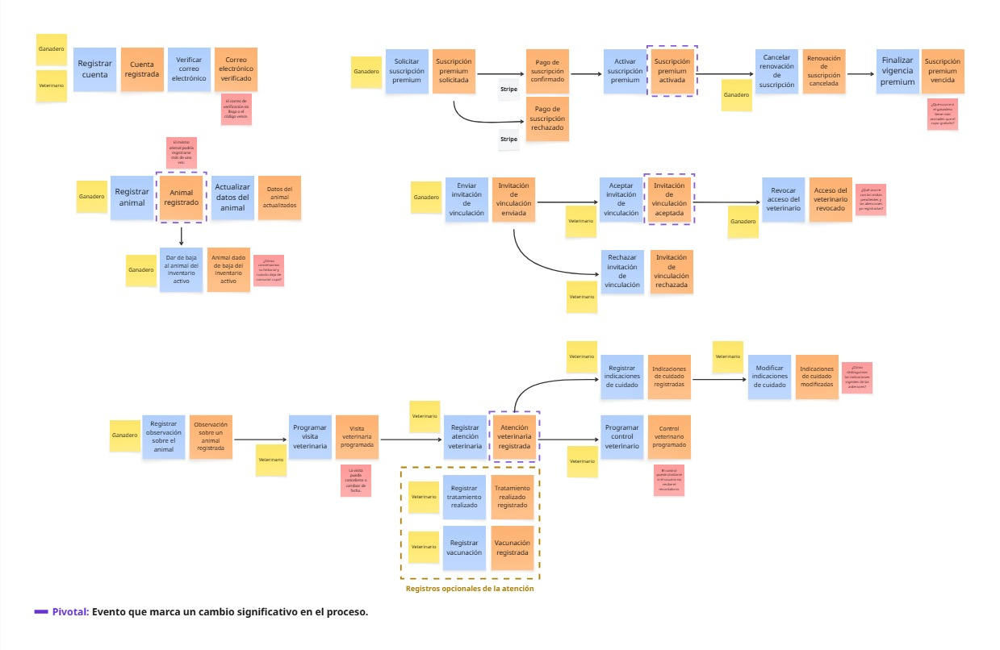

Se incorporaron comandos, representados mediante notas azules, para identificar las acciones que pueden producir los eventos del dominio. Las notas de actores permiten distinguir quién inicia cada operación.

El ganadero administra sus animales, registra observaciones, gestiona las vinculaciones y solicita cambios en su suscripción. El veterinario acepta o rechaza invitaciones, programa visitas y controles, y registra las atenciones realizadas, sus tratamientos, vacunaciones e indicaciones. Esta distribución diferencia las responsabilidades de ambos segmentos objetivo.

Los tratamientos y las vacunaciones se presentan como registros opcionales asociados a una atención. La programación de controles posteriores depende de la evaluación del veterinario y no implica que estos ya se hayan realizado.

##### Políticas

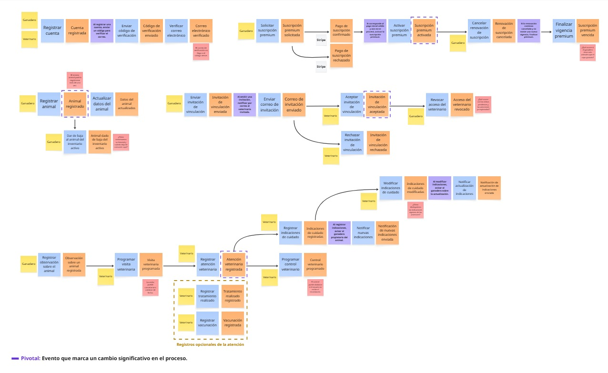

Se añadieron políticas mediante notas lilas para expresar las reacciones automáticas que corresponden ante determinados acontecimientos. Entre ellas se encuentran el envío de un código de verificación después del registro de una cuenta, el envío del correo de invitación y la notificación de nuevas indicaciones o sus modificaciones.

En las suscripciones, la confirmación de un pago inicial válido permite activar los beneficios premium. La cancelación de la renovación conserva dichos beneficios hasta finalizar el período pagado; el vencimiento se aplica cuando termina esa vigencia y no existe una nueva que la sustituya.

Estas políticas permiten diferenciar las acciones automáticas de las decisiones que requieren la intervención del ganadero o del veterinario.

##### Modelos de lectura

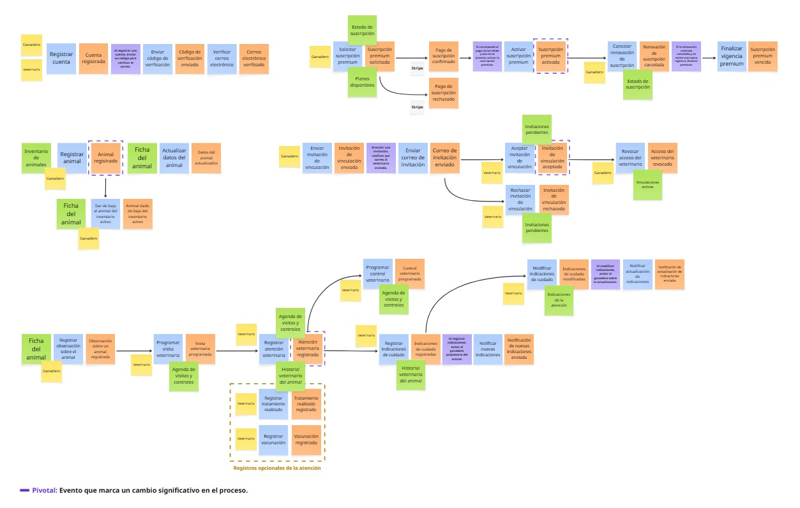

Se incorporaron modelos de lectura, representados mediante notas verdes, para identificar la información que los usuarios necesitan consultar antes de realizar una operación.

Para la gestión del ganado se consideraron el inventario y la ficha del animal. En la vinculación veterinaria se incluyeron las invitaciones pendientes y las vinculaciones activas. Para las atenciones se definieron la agenda de visitas y controles, el historial veterinario del animal y las indicaciones de la atención. Finalmente, los planes disponibles y el estado de suscripción apoyan las decisiones relacionadas con el servicio premium.

Estas vistas presentan información para la consulta y la toma de decisiones. Su aparición en distintos puntos del tablero no implica que sean modelos independientes en cada ubicación.

##### Sistemas externos

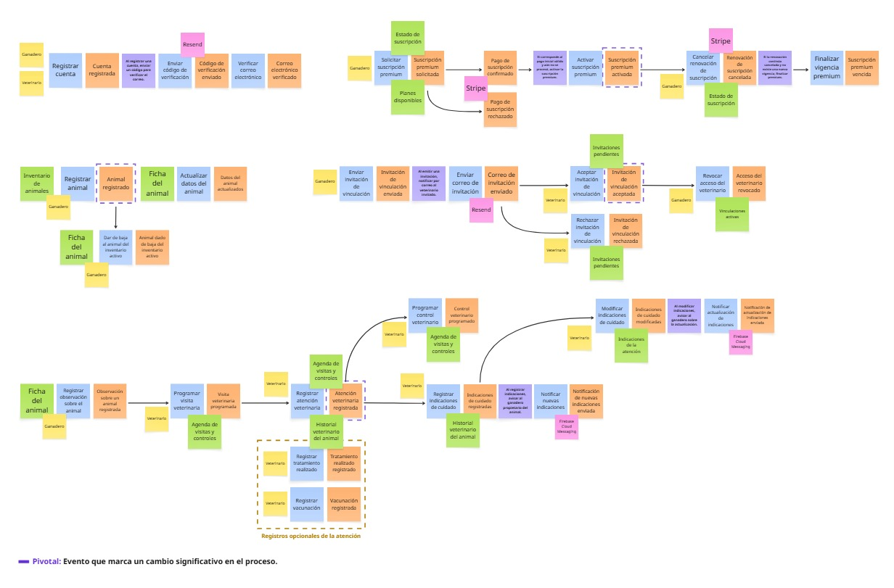

Se identificaron tres servicios externos previstos para apoyar las funcionalidades de ANITEC. Resend participa en el envío de códigos de verificación e invitaciones por correo electrónico. Stripe interviene en el procesamiento de pagos y la gestión de suscripciones. Firebase Cloud Messaging permite enviar notificaciones sobre el registro o la modificación de indicaciones.

Su representación distingue los servicios externos de las responsabilidades propias del dominio. ANITEC mantiene las reglas de autorización, registro y vigencia de beneficios, mientras utiliza estas integraciones para ejecutar operaciones específicas. Un envío aceptado por un proveedor no garantiza que el usuario haya recibido o leído el mensaje.

##### Agregados

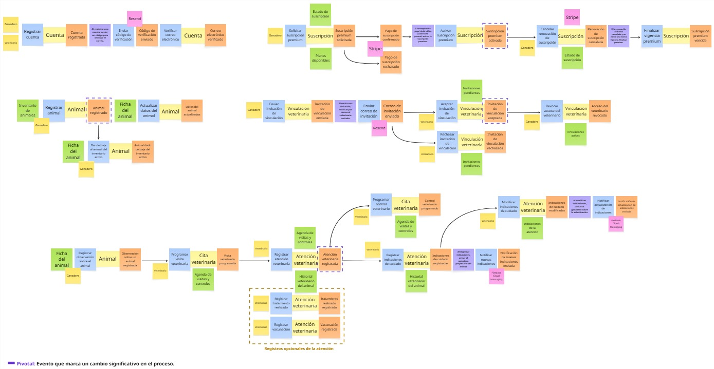

Se propusieron agregados para agrupar información y reglas que deben mantenerse consistentes al procesar los comandos. En esta etapa se identificaron Cuenta, Animal, Vinculación veterinaria, Cita veterinaria, Atención veterinaria y Suscripción.

Cuenta concentra el registro y la verificación del usuario. Animal reúne sus datos y observaciones. Vinculación veterinaria representa el estado de la relación autorizada entre ganadero y veterinario. Cita veterinaria organiza la programación de visitas y controles, mientras que Atención veterinaria agrupa los registros de la atención realizada y sus indicaciones. Suscripción administra el estado y la vigencia del plan contratado.

Las apariciones repetidas de un agregado muestran su participación en distintas operaciones. Estos agregados constituyen una propuesta inicial que se refina al definir las reglas y los límites del modelo.

##### Bounded contexts candidatos

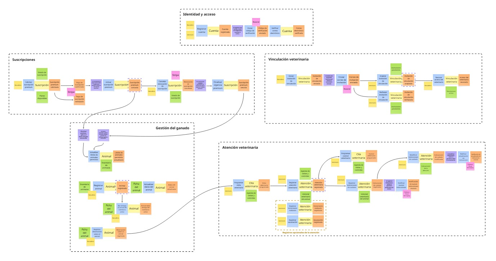

Los elementos del tablero se organizaron en cinco contextos candidatos según sus responsabilidades y conceptos del dominio:

| Bounded context         | Responsabilidad                                                                                       | Agregados candidatos                    |
| ----------------------- | ----------------------------------------------------------------------------------------------------- | --------------------------------------- |
| Identidad y acceso      | Gestionar las cuentas y la verificación del correo electrónico.                                       | Cuenta                                  |
| Gestión del ganado      | Administrar los animales, sus observaciones y el límite de animales activos permitido al ganadero.    | Animal y Capacidad del inventario       |
| Vinculación veterinaria | Gestionar las invitaciones y el estado de la autorización entre ganaderos y veterinarios.             | Vinculación veterinaria                 |
| Atención veterinaria    | Organizar visitas y controles, y registrar las atenciones, tratamientos, vacunaciones e indicaciones. | Cita veterinaria y Atención veterinaria |
| Suscripciones           | Administrar los planes, los resultados de pago y la vigencia de los beneficios premium.               | Suscripción                             |

Durante esta delimitación se incorporó el agregado candidato Capacidad del inventario. Su responsabilidad es representar el límite permitido para el inventario de un ganadero, diferenciándolo de los datos de un animal individual.

Los límites propuestos permiten separar responsabilidades sin perder las relaciones entre los procesos. Representan límites de modelos del dominio y no implican, por sí mismos, un despliegue en servicios independientes.

#### 2.5.1.2. Domain Message Flows Modeling

Los siguientes diagramas muestran cómo se comunican los usuarios, la aplicación móvil, los contextos del negocio y los servicios externos de ANITEC. Se representan cinco escenarios; el tercero se divide en el envío y la aceptación de una invitación.

Las notas azules representan comandos o solicitudes de acción; las naranjas, eventos que ya ocurrieron; las verdes, consultas; las moradas, reglas del negocio; y las grises, respuestas o información de apoyo. Los números permiten seguir cada flujo.

##### Escenario 01: Activar suscripción premium

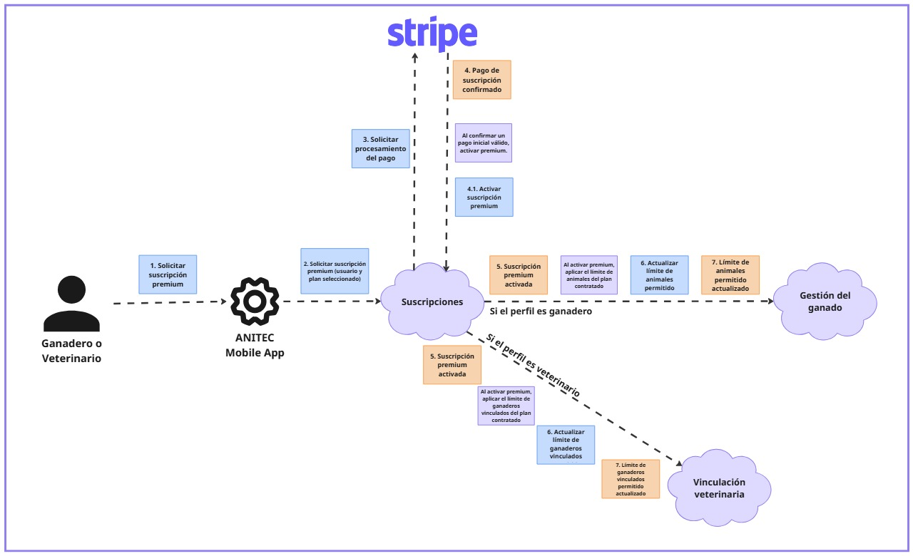

El ganadero o veterinario solicita una suscripción premium desde la aplicación. Suscripciones solicita el procesamiento del pago a Stripe y activa el plan después de recibir una confirmación válida. A continuación, comunica el evento «Suscripción premium activada» al contexto correspondiente al perfil del usuario.

Para el ganadero, Gestión del ganado actualiza el límite de animales activos. Para el veterinario, Vinculación veterinaria actualiza el límite de ganaderos vinculados. Cada contexto aplica el límite del plan contratado y registra el cambio.

##### Escenario 02: Vencimiento de suscripción premium

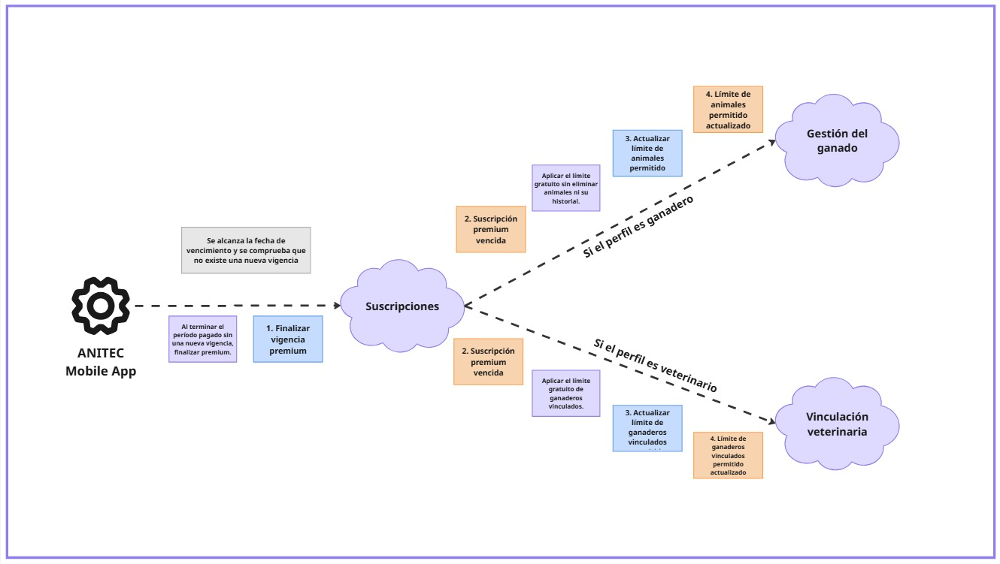

Cuando termina el período pagado y se comprueba que no existe una nueva vigencia, Suscripciones finaliza premium y comunica el evento «Suscripción premium vencida». Gestión del ganado o Vinculación veterinaria recibe el mensaje y actualiza el límite según el plan gratuito del usuario.

En Gestión del ganado se conservan los animales existentes y su historial; se impiden nuevos registros mientras la cantidad de animales activos alcance o supere el límite. Para Vinculación veterinaria se propone conservar las vinculaciones existentes y restringir nuevas aceptaciones bajo la misma condición. Esta última regla queda pendiente de validación con el equipo.

##### Escenario 03A: Enviar invitación de vinculación

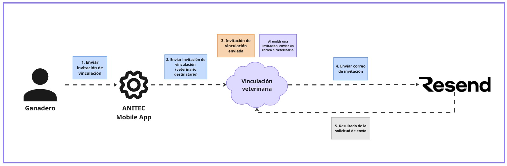

El ganadero solicita invitar a un veterinario desde la aplicación. Vinculación veterinaria registra la invitación pendiente y genera el evento «Invitación de vinculación enviada». Como respuesta a este evento, solicita a Resend el envío del correo al destinatario.

Resend devuelve el resultado de la solicitud de envío. Esta respuesta no confirma que el veterinario haya leído el correo ni activa la vinculación: la autorización requiere que el destinatario acepte la invitación.

##### Escenario 03B: Aceptar invitación de vinculación

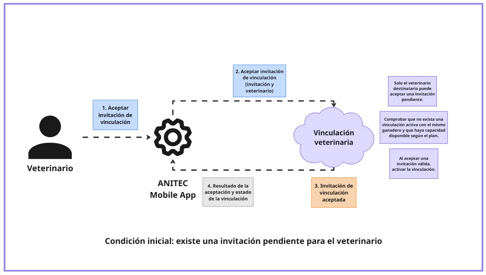

El veterinario acepta una invitación pendiente desde la aplicación. Vinculación veterinaria comprueba que sea el destinatario, que no exista una vinculación activa con el mismo ganadero y que tenga capacidad disponible según su plan.

Si las condiciones se cumplen, registra el evento «Invitación de vinculación aceptada», deja activa la vinculación y devuelve el resultado a la aplicación. Si alguna validación falla, la operación se rechaza y no se concede el acceso.

##### Escenario 04: Programar visita veterinaria

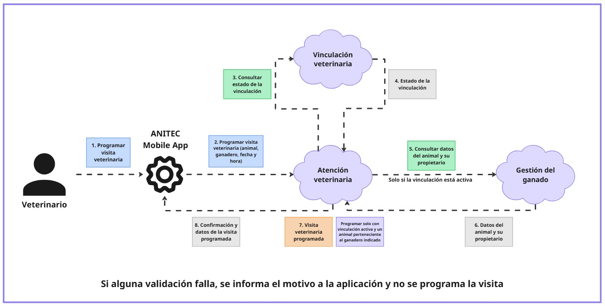

El veterinario solicita programar una visita indicando el animal, el ganadero y la fecha y hora. Atención veterinaria consulta a Vinculación veterinaria para comprobar la autorización y, si está activa, solicita a Gestión del ganado los datos del animal y su propietario.

Tras validar la información, registra el evento «Visita veterinaria programada» y devuelve la confirmación a la aplicación. Una observación del ganadero puede motivar la visita, pero no la programa automáticamente. La programación tampoco equivale al registro de una atención realizada.

##### Escenario 05: Registrar indicaciones de cuidado y notificar al ganadero

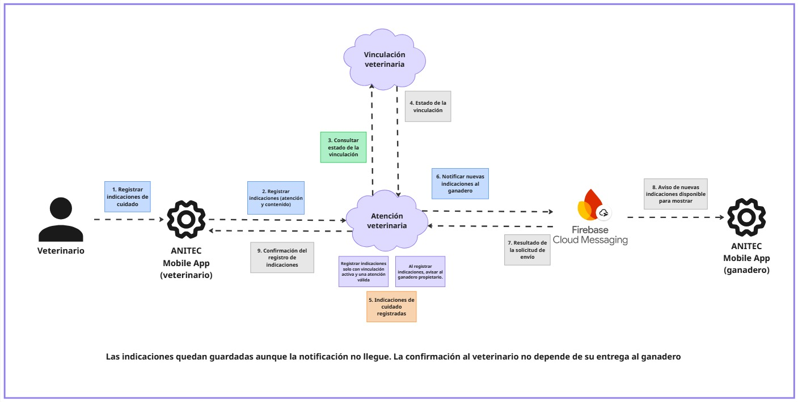

A partir de una atención registrada, el veterinario ingresa las indicaciones de cuidado. Atención veterinaria comprueba que exista una vinculación activa y que la atención sea válida. Luego guarda las indicaciones y genera el evento «Indicaciones de cuidado registradas».

Este evento origina la solicitud de notificación al ganadero mediante Firebase Cloud Messaging (FCM). El servicio devuelve el resultado de la solicitud y gestiona la entrega del aviso al dispositivo. Las indicaciones permanecen disponibles en la aplicación aunque la notificación no llegue; la confirmación del registro al veterinario no depende de esa entrega.

#### 2.5.1.3. Bounded Context Canvases

Los siguientes canvases describen las responsabilidades, comunicaciones y reglas de los cinco contextos candidatos de ANITEC. Las métricas representan objetivos para pruebas con datos simulados, mientras que las preguntas abiertas señalan decisiones pendientes.

##### Gestión del ganado

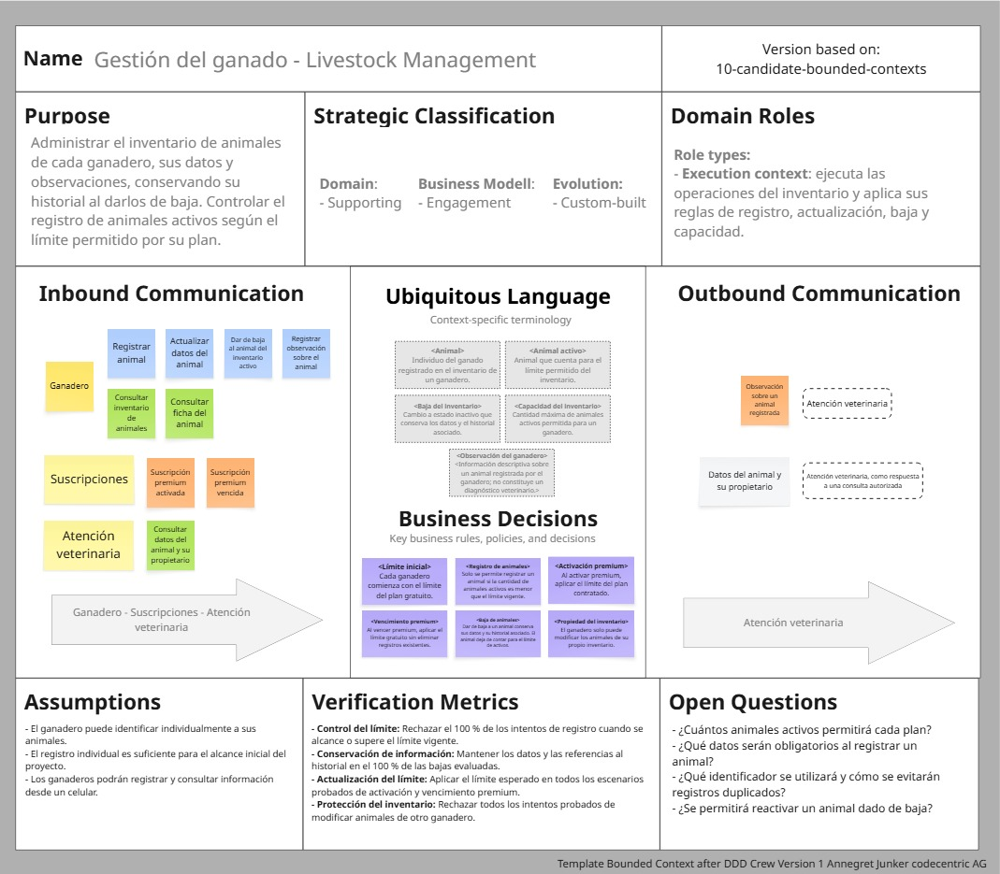

Administra el inventario del ganadero mediante el registro, actualización y baja de animales, además de sus observaciones. Recibe cambios de Suscripciones para actualizar el límite de animales activos y proporciona datos a Atención veterinaria mediante consultas autorizadas.

Sus reglas conservan los registros y el historial al dar de baja animales o vencer premium. Las nuevas altas requieren capacidad disponible y cada ganadero solo puede modificar su inventario. Las pruebas verificarán estas condiciones; quedan pendientes los límites por plan, los datos obligatorios y la identificación de los animales.

##### Atención veterinaria

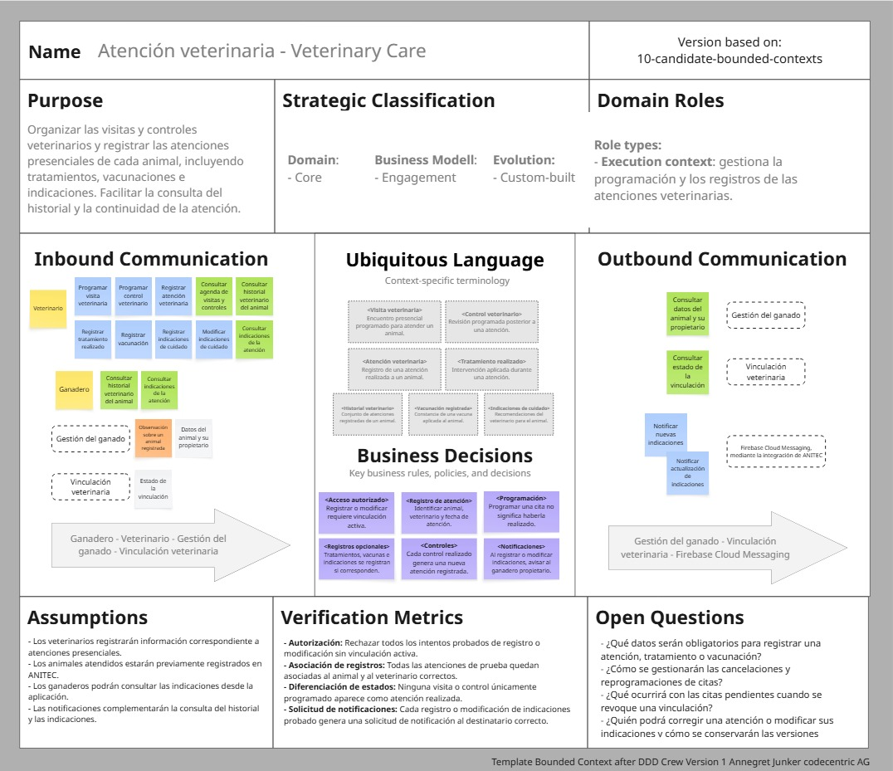

Organiza visitas y controles, y registra las atenciones presenciales con sus tratamientos, vacunaciones e indicaciones. Consulta los datos del animal en Gestión del ganado y la autorización en Vinculación veterinaria. Se propone como contexto central por su aporte a la continuidad de la atención.

Programar una cita no significa haberla realizado: cada control efectuado se registra como una nueva atención. Las indicaciones generan avisos mediante Firebase Cloud Messaging. Se verificarán la autorización y la asociación correcta de registros; quedan pendientes las cancelaciones, las correcciones del historial y el tratamiento de citas tras revocar el acceso.

##### Vinculación veterinaria

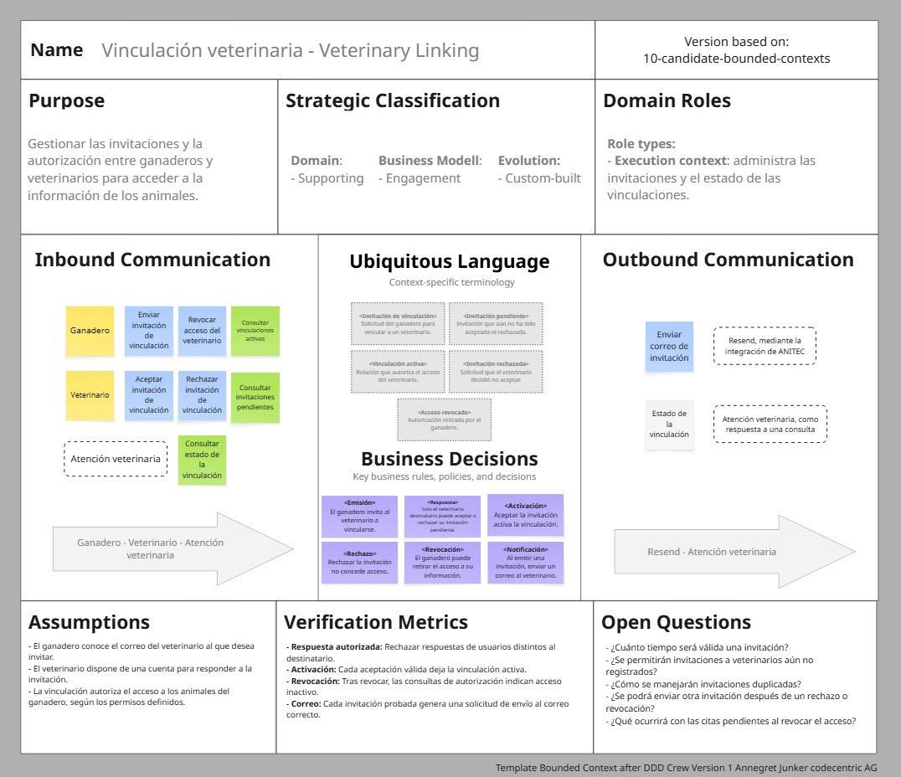

Gestiona las invitaciones y la autorización entre ganaderos y veterinarios. El ganadero invita y puede revocar el acceso; el veterinario destinatario acepta o rechaza. Utiliza Resend para enviar invitaciones y responde a Atención veterinaria sobre el estado de la vinculación.

Las pruebas comprobarán que solo el destinatario responda y que la aceptación o revocación actualice la autorización. Quedan pendientes la vigencia y duplicidad de invitaciones. Además, este canvas requiere incorporar los cambios de Suscripciones y el control del límite de ganaderos vinculados al veterinario.

##### Suscripciones

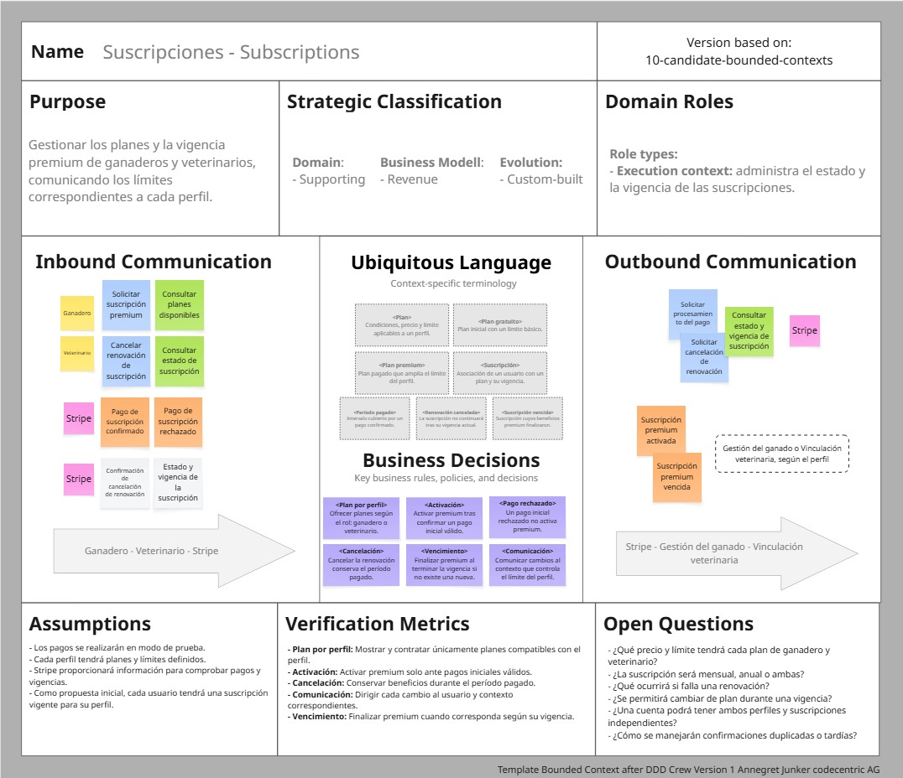

Administra los planes de ambos perfiles: el ganadero amplía su límite de animales y el veterinario su límite de vinculaciones activas. Integra Stripe para gestionar pagos y vigencias, y comunica la activación o el vencimiento al contexto responsable de aplicar cada límite.

Un pago inicial válido activa premium. Cancelar la renovación conserva los beneficios hasta finalizar el período pagado. Las pruebas verificarán estos comportamientos y sus comunicaciones; quedan por definir precios, límites, periodicidad y manejo de renovaciones fallidas. La integración del límite veterinario debe completarse en Vinculación veterinaria.

##### Identidad y acceso

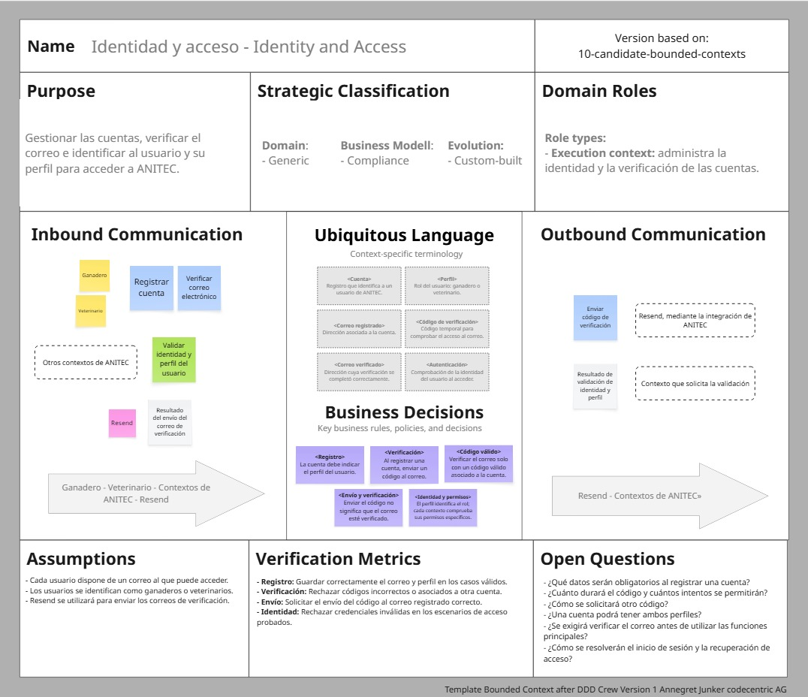

Gestiona las cuentas, sus perfiles y la verificación del correo mediante códigos enviados con Resend. También proporciona información para validar la identidad del usuario. Cada contexto mantiene sus propias comprobaciones de permisos, como la propiedad del inventario o la vinculación activa.

Enviar un código no equivale a verificar el correo: debe comprobarse su validez y asociación con la cuenta. Las pruebas evaluarán el registro y la verificación. Permanecen pendientes la duración y los intentos del código, el inicio de sesión, la recuperación de acceso y la posibilidad de utilizar ambos perfiles.

### 2.5.2. Context Mapping

El Context Map de ANITEC representa las dependencias entre los cinco bounded contexts y sus integraciones externas. La marca U identifica al proveedor de información o capacidades y D al contexto consumidor. Estas relaciones expresan dependencias del modelo, no el orden temporal de las operaciones.

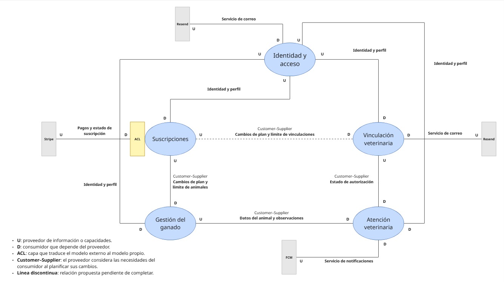

#### Relaciones entre bounded contexts

| Proveedor (U)           | Consumidor (D)                                                                    | Relación                                                                                                                |
| ----------------------- | --------------------------------------------------------------------------------- | ----------------------------------------------------------------------------------------------------------------------- |
| Identidad y acceso      | Gestión del ganado, Atención veterinaria, Vinculación veterinaria y Suscripciones | Proporciona información para validar la identidad y el perfil. Cada consumidor mantiene sus comprobaciones de permisos. |
| Gestión del ganado      | Atención veterinaria                                                              | Proporciona datos del animal, su propietario y observaciones para apoyar las atenciones.                                |
| Vinculación veterinaria | Atención veterinaria                                                              | Proporciona el estado de la vinculación para comprobar el acceso del veterinario.                                       |
| Suscripciones           | Gestión del ganado                                                                | Comunica cambios del plan que determinan el límite de animales activos.                                                 |
| Suscripciones           | Vinculación veterinaria                                                           | Comunica cambios del plan que determinan el límite de vinculaciones activas del veterinario.                            |

En las cuatro relaciones entre Suscripciones, Gestión del ganado, Vinculación veterinaria y Atención veterinaria se propone el patrón Customer–Supplier. Los responsables del contexto proveedor consideran las necesidades del consumidor al coordinar los contratos y sus cambios. Las relaciones de Identidad y acceso se representan como dependencias U/D, sin asignar un patrón adicional.

La conexión entre Suscripciones y Vinculación veterinaria aparece discontinua porque está pendiente de completar su representación en el canvas y los flujos correspondientes.

#### Integraciones externas

Stripe proporciona el procesamiento de pagos y la información de vigencia utilizada por Suscripciones. Se propone una Anti-Corruption Layer (ACL) del lado de ANITEC para traducir los conceptos y resultados de Stripe al modelo propio, reduciendo su dependencia del formato externo.

Resend permite enviar códigos de verificación e invitaciones desde Identidad y acceso y Vinculación veterinaria, respectivamente. Sus dos apariciones en el diagrama representan el mismo servicio. Firebase Cloud Messaging permite enviar las notificaciones de indicaciones desde Atención veterinaria.

Estas integraciones se muestran como dependencias U/D. El uso de sus servicios no implica una relación Customer–Supplier en el sentido de coordinación entre equipos. Los límites del mapa tampoco requieren que cada contexto se despliegue como un microservicio independiente.

### 2.5.3. Software Architecture

La arquitectura de ANITEC se representa mediante el modelo C4. Los diagramas de contexto y contenedores describen los usuarios, los servicios externos y los principales elementos de software que conforman la aplicación móvil y su backend.

#### 2.5.3.1. Software Architecture Context Level Diagram

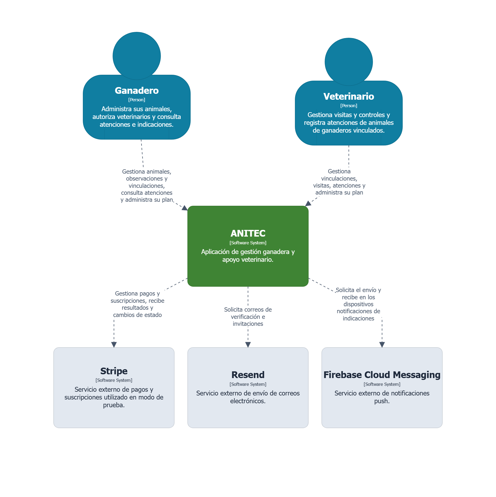

El diagrama presenta la interacción de ANITEC con sus dos perfiles de usuario. El ganadero administra sus animales, registra observaciones, autoriza el acceso de veterinarios y consulta las atenciones e indicaciones. El veterinario gestiona sus vinculaciones, programa visitas y controles y registra la atención de los animales autorizados. Ambos perfiles pueden administrar su suscripción.

ANITEC se integra con Stripe para gestionar pagos y suscripciones en modo de prueba, con Resend para enviar correos de verificación e invitaciones y con Firebase Cloud Messaging para notificar nuevas indicaciones y sus actualizaciones.

#### 2.5.3.2. Software Architecture Container Level Diagrams

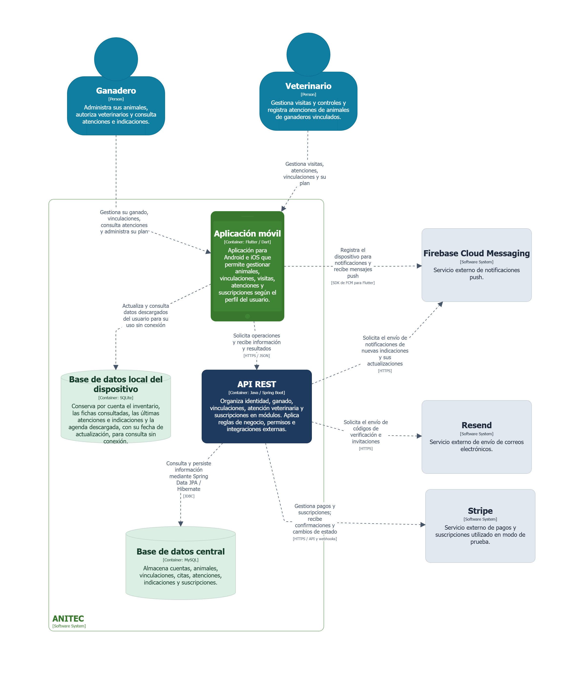

La aplicación móvil se desarrollará con Flutter y Dart para Android e iOS. Se comunicará mediante HTTPS y JSON con una API REST implementada en Java y Spring Boot. Esta API concentrará las reglas de negocio y los permisos, organizados en los módulos de identidad y acceso, gestión del ganado, vinculación veterinaria, atención veterinaria y suscripciones. La información central se almacenará en MySQL mediante Spring Data JPA e Hibernate.

En cada dispositivo, SQLite conservará los datos descargados de la cuenta: inventario, fichas consultadas, últimas atenciones e indicaciones y agenda, según el perfil y sus permisos. Estos datos podrán consultarse sin conexión mostrando su fecha de actualización; las operaciones de registro y modificación requerirán internet. La API gestionará las integraciones con Stripe, Resend y Firebase Cloud Messaging, mientras la aplicación recibirá las notificaciones push.

#### 2.5.3.3. Software Architecture Deployment Diagrams

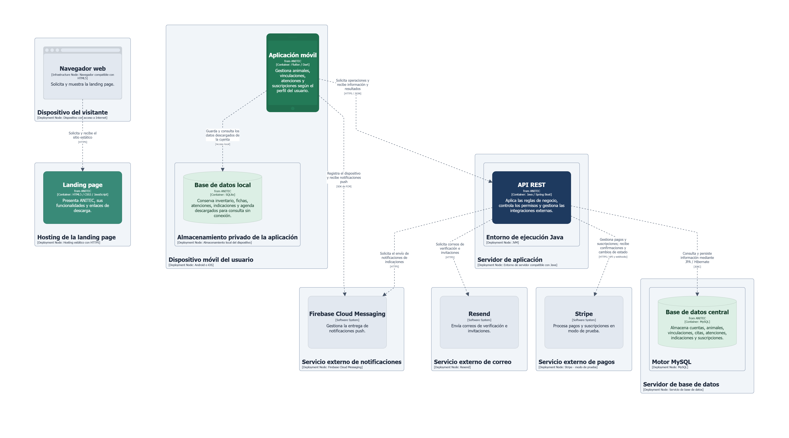

El diagrama muestra cómo se desplegarán los principales componentes de ANITEC. La aplicación móvil desarrollada en Flutter se instalará en dispositivos Android o iOS y utilizará SQLite para almacenar información local y permitir la consulta de datos previamente descargados cuando no exista conexión a internet.

Cuando se requiera registrar o actualizar información, la aplicación se comunicará mediante internet con el backend desarrollado en Java y Spring Boot. Este backend será responsable de procesar las solicitudes, validar los permisos de los usuarios y aplicar las reglas de negocio. La información principal del sistema será almacenada en una base de datos MySQL.

El backend también se integrará con servicios externos como Stripe para gestionar pagos y suscripciones en modo de prueba, Resend para el envío de correos de verificación e invitaciones, y Firebase Cloud Messaging para el envío de notificaciones relacionadas con indicaciones y seguimientos veterinarios.

Por otro lado, la landing page de ANITEC será una aplicación web estática alojada en GitHub Pages y podrá ser consultada desde cualquier navegador mediante internet.

