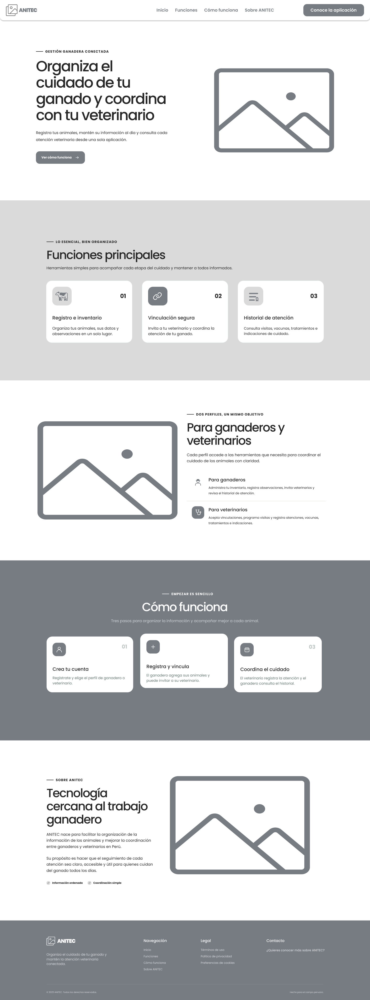
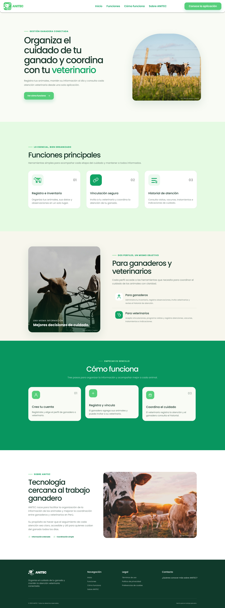

### 3.1.3. Landing Page UI Design

La landing page presenta ANITEC a ganaderos y veterinarios. Explica la propuesta del aplicativo, sus principales funcionalidades y cómo contribuye a organizar la información del ganado y coordinar la atención veterinaria.

El contenido incluye la presentación del producto, las funcionalidades, los perfiles de usuario, los pasos de uso y la información del equipo NOVATICK.

#### 3.1.3.1. Landing Page Wireframe

El wireframe establece la distribución del contenido en la versión de escritorio. Organiza las secciones y los botones principales antes de incorporar los colores, las imágenes y los elementos de marca.

La página comienza con una presentación de ANITEC y continúa con sus funcionalidades y beneficios para cada perfil. Las secciones finales explican su funcionamiento y presentan al equipo.

#### 3.1.3.2. Landing Page Mock-up

El mock-up incorpora la identidad visual de ANITEC mediante la tipografía Poppins, los tonos verdes y las imágenes relacionadas con la actividad ganadera.

Los títulos, las tarjetas y los botones permiten distinguir las secciones y las acciones principales. Esta primera versión representa la presentación visual de la landing page para escritorio.

