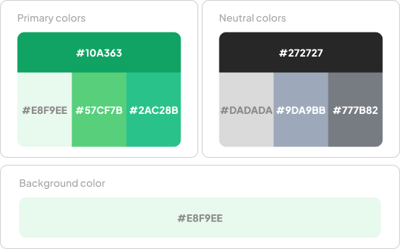
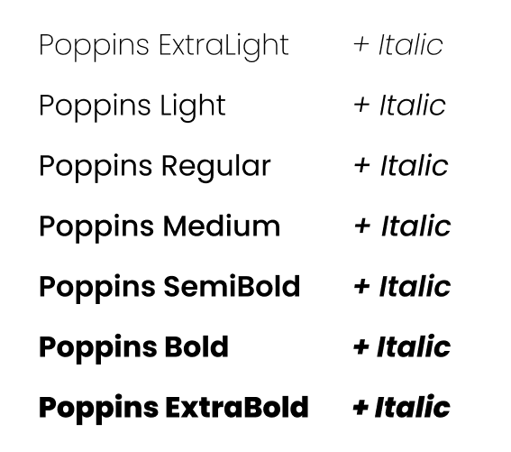
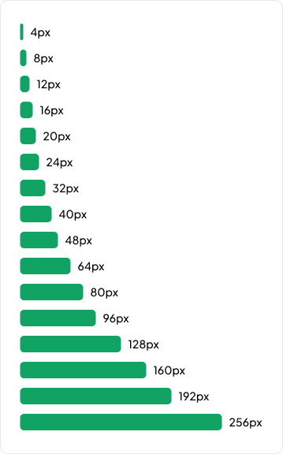

### 3.1.1. Style Guidelines

Las guías de estilo de ANITEC definen los elementos visuales utilizados en la aplicación móvil y la landing page. Incluyen la identidad de marca, los colores, la tipografía y los espacios entre elementos.

#### 3.1.1.1. General Style Guidelines

##### Identidad visual

El logo combina la figura de un bovino, formas relacionadas con el campo y un símbolo de conectividad. Estos elementos representan la gestión ganadera y el apoyo de la tecnología.

La versión horizontal incorpora el nombre ANITEC y se utiliza en espacios donde se requiere identificar la marca junto con su símbolo.

##### Paleta de colores

El verde principal de ANITEC es #10A363. Se acompaña de tonos verdes secundarios, un fondo claro #E8F9EE y colores neutros para textos y elementos de apoyo.

Los colores se utilizan de forma consistente para distinguir botones, fondos y contenido.

##### Tipografía

Se utiliza la familia Poppins. Los pesos Regular y Medium se emplean para el contenido y las etiquetas, mientras que SemiBold y Bold permiten destacar títulos y acciones principales.

##### Espaciado

Se utiliza una escala de separación para mantener una distribución consistente. Los espacios pequeños agrupan elementos relacionados, mientras que los mayores separan bloques y secciones.

##### Lenguaje y tono

Los mensajes se redactan en español, con un tono cercano y respetuoso. Se utilizan nombres claros, como "Registrar animal" y "Programar visita", para facilitar la comprensión de las acciones.

##### Criterios de diseño

Las interfaces mantienen una navegación consistente, textos legibles y acciones principales fáciles de identificar. Los estados y resultados se comunican mediante texto e indicadores visuales, sin depender únicamente del color.
