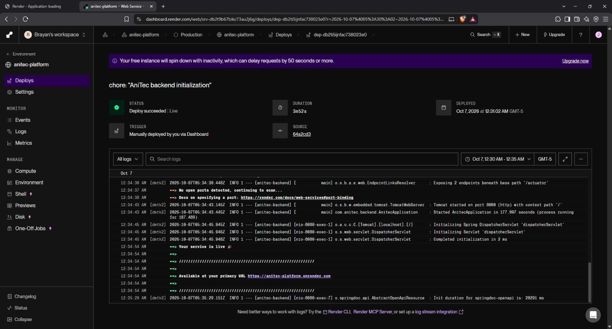
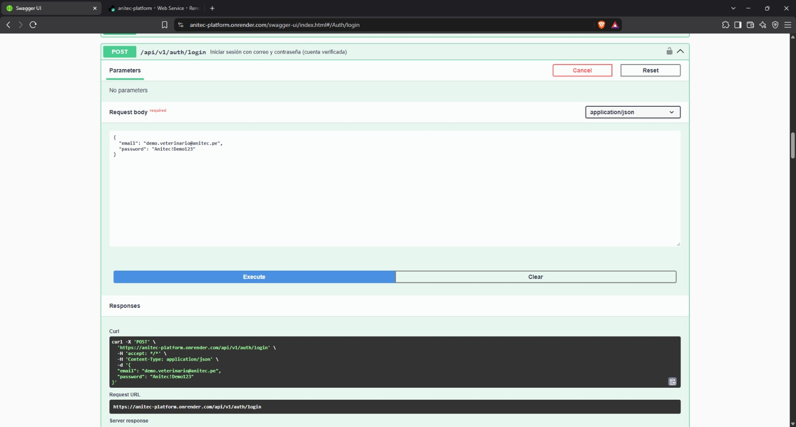
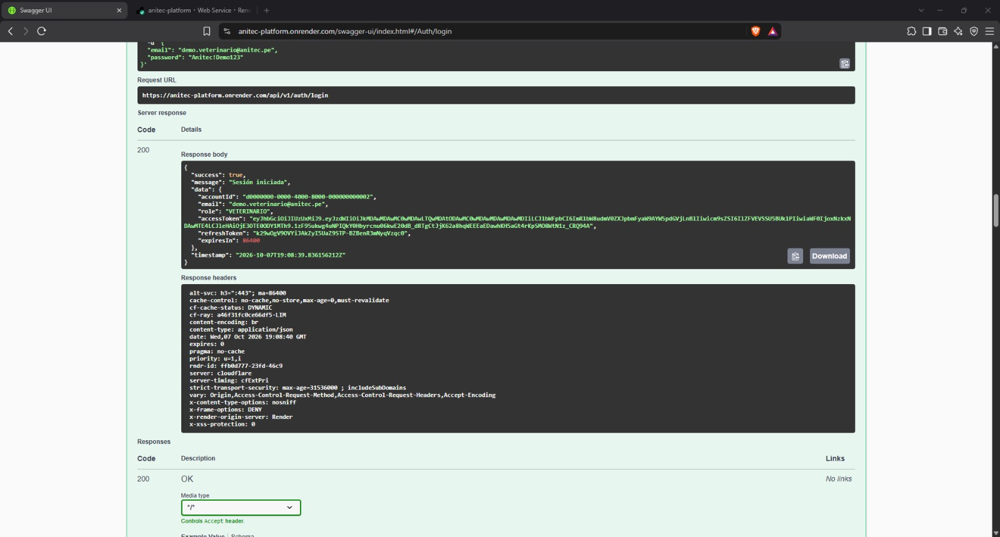

### 4.2. Landing Page, Services & Applications Implementation

Esta sección presenta la implementación de la landing page, los servicios del backend y la aplicación móvil de ANITEC. El trabajo se organiza por sprints e incluye planificación, desarrollo, pruebas, documentación y evidencias de ejecución y despliegue.

#### 4.2.1. Sprint 1

El primer sprint comprende la presentación pública de ANITEC, el diseño de interfaces y el desarrollo inicial de cuentas, sesiones y gestión del inventario. Las evidencias incluyen la landing page publicada, pruebas locales del backend y su despliegue en Render con una comprobación de inicio de sesión. La integración con la aplicación móvil permanece pendiente.

##### 4.2.1.1. Sprint Planning 1

El objetivo del sprint es establecer las funciones iniciales para presentar ANITEC y permitir al ganadero acceder a su cuenta y gestionar la información de sus animales.

| Elemento                     | Descripción                                                                                       |
| ---------------------------- | ------------------------------------------------------------------------------------------------- |
| Sprint                       | Sprint 1                                                                                          |
| Objetivo                     | Presentar la solución y desarrollar las operaciones iniciales de acceso y gestión del inventario. |
| Historias seleccionadas      | US30, US01, US02, US03, US04, US25, US26, US27, US28 y TS01.                                      |
| Puntos planificados          | 32 story points, según el Product Backlog.                                                        |
| Velocidad objetivo           | Aproximadamente 31 puntos por sprint. No corresponde a una velocidad medida.                      |
| Revisión del sprint anterior | No aplica por tratarse del primer sprint de implementación.                                       |
| Retrospectiva anterior       | No aplica por tratarse del primer sprint de implementación.                                       |
| Coordinación                 | Distribución del trabajo entre landing page, backend, interfaces móviles y documentación.         |

El cierre de las historias depende del cumplimiento de sus criterios de aceptación y de las pruebas correspondientes.

##### 4.2.1.2. Aspect Leaders and Collaborators

La siguiente tabla registra las responsabilidades y las tareas de apoyo propuestas para completar la revisión del incremento.

| Integrante                             | Responsabilidad                                                                   | Situación                                                                        |
| -------------------------------------- | --------------------------------------------------------------------------------- | -------------------------------------------------------------------------------- |
| Johan Yonel León Morales               | Diseño de interfaces, organización del informe e incorporación de evidencias.     | Diseño realizado y documentación en actualización.                               |
| Jorge Brayan Ayala Fernández           | Desarrollo, pruebas y despliegue del backend, y preparación de pantallas móviles. | Backend desplegado, con pruebas locales y evidencia de inicio de sesión público. |
| Richard Enrique Lozano León            | Implementación y publicación de la landing page.                                  | Publicada en GitHub Pages.                                                       |
| Ghiou Justinn Mauricio Silva           | Revisar las pantallas principales frente a los mock-ups.                          | Tarea propuesta, pendiente de confirmación.                                      |
| Edgar Alexander Mauricio Montes Zamora | Apoyar la revisión del acceso público y de las evidencias del despliegue.         | Participación pendiente de confirmación.                                         |

##### 4.2.1.3. Sprint Backlog 1

El Sprint Backlog descompone las historias seleccionadas en tareas. Los estados corresponden al avance documentado en esta versión del informe.

| Tarea | Historias relacionadas  | Descripción                                                        | Responsable        | Estado                                                                          |
| ----- | ----------------------- | ------------------------------------------------------------------ | ------------------ | ------------------------------------------------------------------------------- |
| T01   | US30                    | Implementar y publicar la landing page.                            | Richard            | Publicada. Contenidos legales y de contacto pendientes.                         |
| T02   | US30                    | Documentar las pruebas de navegación y adaptación móvil.           | Johan              | Evidencias incorporadas.                                                        |
| T03   | US25, US26              | Implementar el registro de cuentas y la verificación de correo.    | Jorge              | Código disponible. Validación completa pendiente.                               |
| T04   | US27, US28              | Implementar el inicio y cierre de sesión.                          | Jorge              | Inicio probado localmente y en Render. Evidencia de cierre pendiente.           |
| T05   | US01                    | Implementar el registro de animales.                               | Jorge              | Código disponible. Evidencia del resultado de registro pendiente.               |
| T06   | US02, US03              | Implementar las consultas del inventario y de la ficha del animal. | Jorge              | Pruebas locales documentadas.                                                   |
| T07   | US04                    | Implementar la actualización de datos del animal.                  | Jorge              | Prueba local documentada.                                                       |
| T08   | TS01                    | Proteger las operaciones mediante autenticación y permisos.        | Jorge              | Rechazo sin autenticación comprobado. Revisión de permisos pendiente.           |
| T09   | TS01                    | Configurar la documentación de servicios en Swagger.               | Jorge              | Disponible localmente y desde la dirección pública.                             |
| T10   | US01-US04, US25-US28    | Diseñar los mock-ups de las pantallas del sprint.                  | Johan              | Diseño realizado.                                                               |
| T11   | US01-US04, US25-US28    | Implementar las pantallas móviles y conectarlas con los servicios. | Jorge              | Desarrollo de pantallas en curso. Integración pendiente.                        |
| T12   | US01-US04, US25-US28    | Revisar las pantallas frente a los mock-ups.                       | Justinn, propuesto | Pendiente de confirmación y ejecución.                                          |
| T13   | TS01                    | Desplegar el backend en Render.                                    | Jorge              | Desplegado, con evidencia de inicio de sesión exitoso.                          |
| T14   | TS01                    | Revisar el acceso público y las evidencias del despliegue.         | Edgar, propuesto   | Evidencias disponibles. Participación en la revisión pendiente de confirmación. |
| T15   | Todas las seleccionadas | Consolidar la documentación y las evidencias del sprint.           | Johan              | En curso.                                                                       |

Los 32 puntos representan el alcance planificado y no se contabilizan como completados en su totalidad. Permanecen pendientes la integración móvil y las validaciones indicadas en la tabla.

##### 4.2.1.4. Development Evidence for Sprint Review

###### Landing Page

La landing page se implementó con HTML, CSS y JavaScript. Presenta la propuesta de valor, las funciones principales, los perfiles de ganadero y veterinario y los pasos generales de uso.

El archivo `index.html` contiene la estructura, `styles.css` define la presentación y adaptación a distintas pantallas, y `script.js` controla el menú móvil y las ventanas informativas.

Repositorio: [ANITEC Website](https://github.com/upc-pre-202620-1acc0238-13980-Novatick/anitec-website)

Los contenidos definitivos de términos de uso, política de privacidad y contacto permanecen pendientes. Actualmente, estas opciones muestran avisos informativos.

###### Backend

El backend se desarrolla con Java 21 y Spring Boot. Utiliza PostgreSQL e incluye módulos de identidad y acceso, gestión del ganado, vinculación veterinaria, atención veterinaria y suscripciones.

| Área               | Desarrollo identificado en el código                                                                    |
| ------------------ | ------------------------------------------------------------------------------------------------------- |
| Identidad y acceso | Registro de cuentas, verificación de correo, inicio de sesión, renovación de tokens y cierre de sesión. |
| Gestión del ganado | Registro de animales, consulta del inventario y de sus fichas, y actualización de datos.                |
| Control de acceso  | Validación de autenticación y permisos para ejecutar operaciones.                                       |
| Persistencia       | Almacenamiento en PostgreSQL y migraciones para crear y actualizar tablas.                              |
| Documentación      | Configuración de Swagger para consultar y probar las operaciones.                                       |

Repositorio: [ANITEC Platform](https://github.com/upc-pre-202620-1acc0238-13980-Novatick/anitec-platform)

El repositorio también incluye avances de vinculación veterinaria, atención veterinaria y suscripciones, previstos para los siguientes sprints. Los pagos permanecen simulados y el envío de notificaciones push está pendiente de implementación.

La conexión entre el backend y las pantallas móviles permanece pendiente.

##### 4.2.1.5. Testing Suite Evidence for Sprint Review

###### Landing Page

Se realizaron pruebas manuales sobre la landing page publicada, utilizando una vista de escritorio y una vista móvil simulada en el navegador.

| Código | Prueba                                    | Resultado observado                                            | Estado   |
| ------ | ----------------------------------------- | -------------------------------------------------------------- | -------- |
| LP01   | Acceder a la dirección pública            | La página carga su contenido, imágenes y estilos.              | Conforme |
| LP02   | Navegar entre secciones                   | Los enlaces permiten acceder a las secciones correspondientes. | Conforme |
| LP03   | Consultar la página en una pantalla móvil | El contenido se adapta a una distribución vertical.            | Conforme |
| LP04   | Utilizar el menú móvil                    | El menú permite abrir, cerrar y seleccionar enlaces.           | Conforme |
| LP05   | Abrir y cerrar las ventanas informativas  | Los avisos se muestran y pueden cerrarse.                      | Conforme |

LP05 comprueba el funcionamiento de las ventanas. Los contenidos definitivos de los avisos legales y de contacto permanecen pendientes.

###### Evidencia LP01 - Acceso a la página pública

###### Evidencia LP02 - Navegación entre secciones

La captura muestra la sección Funciones después de seleccionar su enlace.

###### Evidencia LP03 - Adaptación a pantalla móvil

###### Evidencia LP04 - Menú móvil

###### Evidencia LP05 - Ventana informativa de contacto

###### Backend

Se realizaron pruebas manuales mediante Swagger con datos de demostración. Las pruebas BE01 a BE05 corresponden al entorno local y BE06 al backend desplegado en Render.

| Código | Prueba                                              | Resultado observado                                                                     | Estado   |
| ------ | --------------------------------------------------- | --------------------------------------------------------------------------------------- | -------- |
| BE01   | Iniciar sesión con credenciales válidas             | Respuesta 200 y mensaje de sesión iniciada.                                             | Conforme |
| BE02   | Consultar el inventario de animales                 | Respuesta 200 con el listado de animales.                                               | Conforme |
| BE03   | Consultar la ficha de un animal                     | Respuesta 200 con sus datos y registros relacionados.                                   | Conforme |
| BE04   | Actualizar los datos de un animal                   | Respuesta 200 y mensaje de animal actualizado.                                          | Conforme |
| BE05   | Consultar el catálogo de especies sin autenticación | Respuesta 401 con mensaje de usuario no autenticado o sesión expirada.                  | Conforme |
| BE06   | Iniciar sesión desde el backend público             | Respuesta 200 y sesión iniciada para una cuenta de demostración con perfil veterinario. | Conforme |

###### Evidencia BE01 - Inicio de sesión

###### Evidencia BE02 - Consulta del inventario

###### Evidencia BE03 - Consulta de la ficha del animal

###### Evidencia BE04 - Actualización del animal

La respuesta confirma la actualización y muestra el nombre modificado.

###### Evidencia BE05 - Control de acceso

La solicitud sin autenticación fue rechazada con una respuesta 401.

La evidencia BE06 se presenta en el apartado 4.2.1.8. Estas pruebas comprueban las operaciones indicadas y no incluyen la integración con la aplicación móvil.

##### 4.2.1.6. Execution Evidence for Sprint Review

###### Landing Page

La landing page se encuentra publicada en GitHub Pages. Las capturas del apartado 4.2.1.5 muestran su ejecución en escritorio y vista móvil simulada.

Sitio publicado: [ANITEC Landing Page](https://upc-pre-202620-1acc0238-13980-novatick.github.io/anitec-website/)

###### Backend

El backend se ejecutó inicialmente en el entorno local, donde se comprobaron las operaciones descritas en el apartado 4.2.1.5. Posteriormente, se desplegó en Render y se verificó el inicio de sesión desde su dirección pública.

Las evidencias del entorno desplegado se presentan en el apartado 4.2.1.8.

##### 4.2.1.7. Services Documentation Evidence for Sprint Review

El backend utiliza Swagger para documentar sus servicios. Esta interfaz permite consultar métodos HTTP, rutas, datos requeridos y respuestas, además de ejecutar solicitudes de prueba.

Las operaciones se agrupan en autenticación, cuentas, animales, fincas, especies, vinculaciones, invitaciones, visitas, atenciones, suscripciones, notificaciones y administración.

Para el Sprint 1 se consideran principalmente las operaciones de cuentas, sesiones y gestión del inventario. La documentación también incluye operaciones adelantadas de otros sprints.

Documentación pública: [Swagger UI de ANITEC](https://anitec-platform.onrender.com/swagger-ui/index.html)

##### 4.2.1.8. Software Deployment Evidence for Sprint Review

###### Landing Page

La landing page se publicó en GitHub Pages mediante archivos estáticos de HTML, CSS, JavaScript e imágenes. La evidencia LP01 del apartado 4.2.1.5 muestra su acceso desde la dirección pública.

Sitio desplegado: [ANITEC Landing Page](https://upc-pre-202620-1acc0238-13980-novatick.github.io/anitec-website/)

###### Backend

El backend se desplegó en Render. La siguiente captura muestra el estado de despliegue exitoso y el inicio de la aplicación.

###### Evidencia BE06 - Inicio de sesión en Render

Se ejecutó una solicitud de inicio de sesión desde Swagger con una cuenta de demostración de perfil veterinario.

La operación devolvió una respuesta HTTP 200 y el mensaje de sesión iniciada, comprobando esta operación en el entorno desplegado.

- Servicio desplegado: [ANITEC Backend](https://anitec-platform.onrender.com)
- Documentación pública: [Swagger UI](https://anitec-platform.onrender.com/swagger-ui/index.html)

##### 4.2.1.9. Team Collaboration Insights during Sprint

El equipo utiliza GitHub para registrar los cambios del informe y organizar su integración mediante ramas. Las capturas presentan la actividad del repositorio, las contribuciones registradas y la relación entre las ramas.

###### Actividad del repositorio

###### Contribuciones por integrante

Las estadísticas corresponden a los commits incluidos en main durante el periodo mostrado y excluyen los commits de merge. No reflejan todos los cambios pendientes de integrar desde develop ni las contribuciones de los repositorios de la landing page y el backend.

###### Ramas e integración

El gráfico presenta la relación entre las ramas de trabajo y las ramas de integración. La cantidad de commits complementa el seguimiento, pero no representa por sí sola el esfuerzo de cada integrante.

