

### 4.2. Landing Page, Services & Applications Implementation

Esta sección presenta la implementación de la landing page, los servicios del backend y la aplicación móvil de ANITEC. El trabajo se organiza por sprints e incluye la planificación, el desarrollo, las pruebas, la documentación y las evidencias de ejecución y despliegue.

#### 4.2.1. Sprint 1

El primer sprint comprende la presentación pública de ANITEC, el diseño de las interfaces y el desarrollo inicial de cuentas, sesiones y gestión del inventario. Las evidencias disponibles incluyen la landing page publicada y pruebas locales del backend. La integración con la aplicación móvil permanece pendiente.

##### 4.2.1.1. Sprint Planning 1

El objetivo del sprint es establecer las funciones iniciales para presentar ANITEC y permitir al ganadero acceder a su cuenta y gestionar la información de sus animales.

| Elemento                     | Descripción                                                                                       |
| ---------------------------- | ------------------------------------------------------------------------------------------------- |
| Sprint                       | Sprint 1                                                                                          |
| Objetivo                     | Presentar la solución y desarrollar las operaciones iniciales de acceso y gestión del inventario. |
| Historias seleccionadas      | US30, US01, US02, US03, US04, US25, US26, US27, US28 y TS01.                                      |
| Puntos planificados          | 32 story points, según el Product Backlog.                                                        |
| Velocidad objetivo           | Aproximadamente 31 puntos por sprint. No corresponde a una velocidad medida.                      |
| Revisión del sprint anterior | No aplica por tratarse del primer sprint de implementación.                                       |
| Retrospectiva anterior       | No aplica por tratarse del primer sprint de implementación.                                       |
| Coordinación                 | Distribución del trabajo entre landing page, backend, interfaces móviles y documentación.         |

La selección del backlog expresa el alcance previsto. El cierre de las historias depende del cumplimiento de sus criterios de aceptación y de las pruebas correspondientes, no únicamente de la existencia de código.

##### 4.2.1.2. Aspect Leaders and Collaborators

La siguiente tabla registra los responsables conocidos y propone tareas de apoyo para completar la revisión del incremento.

| Integrante                             | Responsabilidad                                                                          | Situación                                                |
| -------------------------------------- | ---------------------------------------------------------------------------------------- | -------------------------------------------------------- |
| Johan Yonel León Morales               | Diseño de interfaces, organización del informe e incorporación de evidencias del sprint. | Trabajo realizado durante el avance.                     |
| Jorge Brayan Ayala Fernández           | Desarrollo del backend, preparación de pantallas móviles y pruebas de los servicios.     | Desarrollo en curso, con evidencias locales del backend. |
| Richard Enrique Lozano León            | Implementación y publicación de la landing page en GitHub Pages.                         | Implementación y publicación realizadas.                 |
| Ghiou Justinn Mauricio Silva           | Revisar las pantallas principales y registrar diferencias respecto a los mock-ups.       | Tarea de apoyo propuesta, pendiente de confirmación.     |
| Edgar Alexander Mauricio Montes Zamora | Comprobar la dirección pública del backend y recopilar las evidencias del despliegue.    | Tarea de apoyo propuesta, pendiente de confirmación.     |

##### 4.2.1.3. Sprint Backlog 1

El Sprint Backlog descompone las historias seleccionadas en tareas de implementación, pruebas e integración. Los estados corresponden al avance documentado en esta versión del informe.

| Tarea | Historias relacionadas  | Descripción                                                             | Responsable        | Estado                                                                |
| ----- | ----------------------- | ----------------------------------------------------------------------- | ------------------ | --------------------------------------------------------------------- |
| T01   | US30                    | Implementar y publicar la landing page.                                 | Richard            | Publicada, con contenidos legales y de contacto pendientes.           |
| T02   | US30                    | Documentar las pruebas de navegación y adaptación a pantallas móviles.  | Johan              | Evidencias incorporadas.                                              |
| T03   | US25, US26              | Implementar el registro de cuentas y la verificación de correo.         | Jorge              | Código disponible. Validación completa pendiente.                     |
| T04   | US27, US28              | Implementar el inicio y cierre de sesión.                               | Jorge              | Inicio de sesión probado localmente. Evidencia de cierre pendiente.   |
| T05   | US01                    | Implementar el registro de animales.                                    | Jorge              | Código disponible. Evidencia del resultado de registro pendiente.     |
| T06   | US02, US03              | Implementar las consultas del inventario y de la ficha del animal.      | Jorge              | Pruebas locales documentadas.                                         |
| T07   | US04                    | Implementar la actualización de datos del animal.                       | Jorge              | Prueba local documentada.                                             |
| T08   | TS01                    | Proteger las operaciones del backend mediante autenticación y permisos. | Jorge              | Rechazo sin autenticación comprobado. Revisión de permisos pendiente. |
| T09   | TS01                    | Configurar la documentación de servicios en Swagger.                    | Jorge              | Disponible en el entorno local.                                       |
| T10   | US01–US04, US25–US28    | Diseñar los mock-ups de las pantallas relacionadas con el sprint.       | Johan              | Diseño realizado.                                                     |
| T11   | US01–US04, US25–US28    | Implementar las pantallas móviles y conectarlas con los servicios.      | Jorge              | Desarrollo de pantallas en curso. Integración pendiente.              |
| T12   | US01–US04, US25–US28    | Revisar las pantallas implementadas frente a los mock-ups.              | Justinn, propuesto | Pendiente de confirmación y ejecución.                                |
| T13   | TS01                    | Completar el despliegue del backend en Render.                          | Jorge              | En preparación.                                                       |
| T14   | TS01                    | Comprobar el acceso público y recopilar evidencias del despliegue.      | Edgar, propuesto   | Pendiente de confirmación y ejecución.                                |
| T15   | Todas las seleccionadas | Consolidar la documentación y las evidencias del Sprint 1.              | Johan              | En curso.                                                             |

Los 32 puntos corresponden a las historias planificadas y no se contabilizan como completados en su totalidad. Las pruebas locales del backend demuestran avances específicos, mientras que la integración móvil y la validación pública permanecen pendientes.

##### 4.2.1.4. Development Evidence for Sprint Review

###### Landing Page

La landing page de ANITEC se implementó con HTML, CSS y JavaScript. Presenta la propuesta de valor, las funciones principales, los perfiles de ganadero y veterinario y los pasos generales de uso.

El archivo `index.html` contiene la estructura, `styles.css` define la presentación y adaptación a diferentes pantallas, y `script.js` controla el menú móvil y las ventanas informativas.

Repositorio: [ANITEC Website](https://github.com/upc-pre-202620-1acc0238-13980-Novatick/anitec-website)

Los contenidos definitivos de términos de uso, política de privacidad y contacto permanecen pendientes. Actualmente, estas opciones muestran avisos informativos.

###### Backend

El backend de ANITEC se desarrolla con Java 21 y Spring Boot. Utiliza PostgreSQL para almacenar la información e incluye módulos de identidad y acceso, gestión del ganado, vinculación veterinaria, atención veterinaria y suscripciones.

Para el alcance del Sprint 1, el código incorpora operaciones de cuentas, sesiones y gestión del inventario. Las operaciones protegidas utilizan tokens de autenticación y comprobaciones de permisos.

| Área               | Desarrollo identificado en el código                                                                    |
| ------------------ | ------------------------------------------------------------------------------------------------------- |
| Identidad y acceso | Registro de cuentas, verificación de correo, inicio de sesión, renovación de tokens y cierre de sesión. |
| Gestión del ganado | Registro de animales, consulta del inventario y de sus fichas, y actualización de datos.                |
| Control de acceso  | Validación de la autenticación y de los permisos necesarios para ejecutar las operaciones.              |
| Persistencia       | Almacenamiento en PostgreSQL y archivos de migración para crear y actualizar las tablas.                |
| Documentación      | Configuración de Swagger para consultar y probar las operaciones del backend.                           |

La siguiente imagen presenta la organización del proyecto y sus módulos.

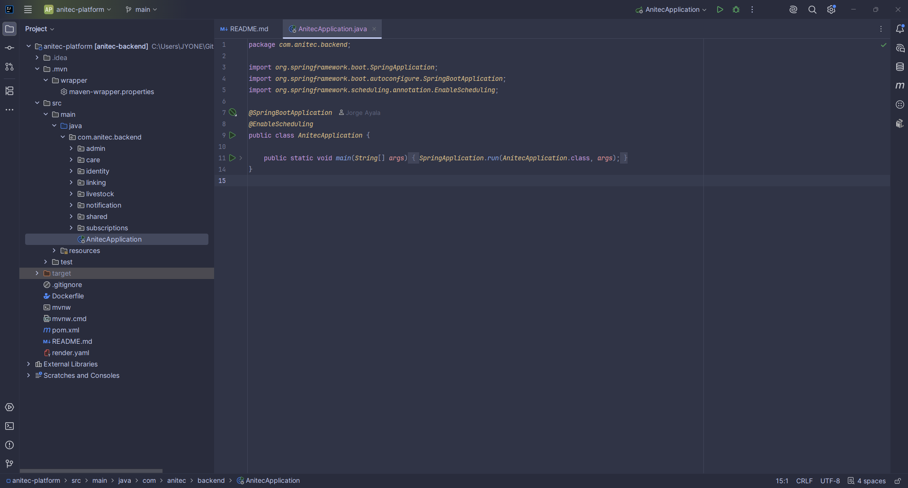

El repositorio también incluye avances de vinculación veterinaria, atención veterinaria y suscripciones, correspondientes a funcionalidades previstas para los siguientes sprints. La integración de pagos permanece simulada y el envío de notificaciones push está pendiente de implementación.

El backend y las pantallas móviles se desarrollan por separado. La conexión entre ambos permanece pendiente.

##### 4.2.1.5. Testing Suite Evidence for Sprint Review

###### Landing Page

Se realizaron pruebas manuales sobre la landing page publicada en GitHub Pages, utilizando una vista de escritorio y una vista móvil simulada mediante las herramientas del navegador.

| Código | Prueba                                    | Resultado observado                                                     | Estado   |
| ------ | ----------------------------------------- | ----------------------------------------------------------------------- | -------- |
| LP01   | Acceder a la dirección pública            | La página carga su contenido, imágenes y estilos.                       | Conforme |
| LP02   | Navegar entre las secciones               | Los enlaces del menú permiten acceder a las secciones correspondientes. | Conforme |
| LP03   | Consultar la página en una pantalla móvil | El contenido se adapta a una distribución vertical.                     | Conforme |
| LP04   | Utilizar el menú móvil                    | El menú permite abrir, cerrar y seleccionar enlaces de navegación.      | Conforme |
| LP05   | Abrir y cerrar las ventanas informativas  | Los avisos se muestran y pueden cerrarse.                               | Conforme |

El resultado de LP05 corresponde al funcionamiento de las ventanas. Los contenidos definitivos de los avisos legales y de contacto permanecen pendientes.

###### Evidencia LP01 - Acceso a la página pública

La captura muestra la landing page cargada desde su dirección en GitHub Pages.

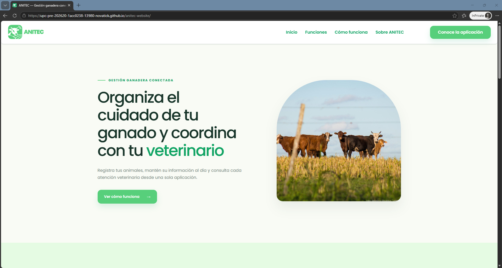

###### Evidencia LP02 - Navegación entre secciones

La captura muestra la sección Funciones después de seleccionar su enlace en el menú de navegación.

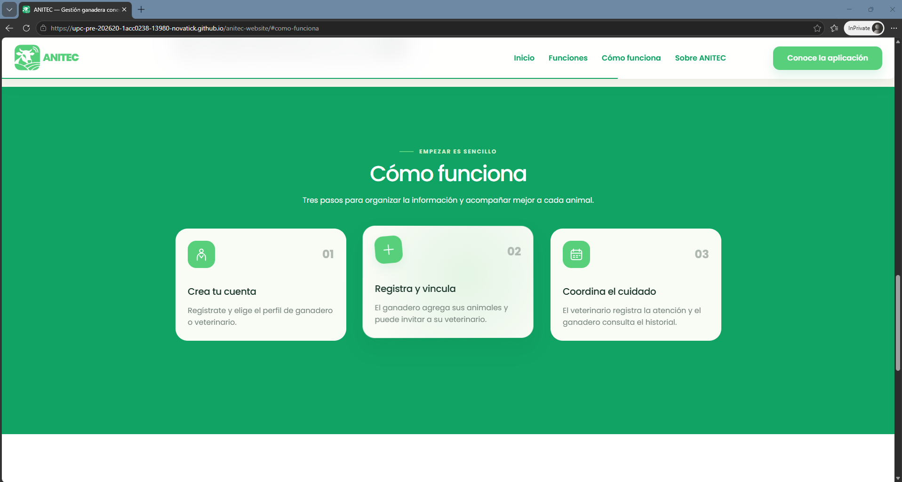

###### Evidencia LP03 - Adaptación a pantalla móvil

La captura muestra la distribución del contenido en una vista móvil simulada.

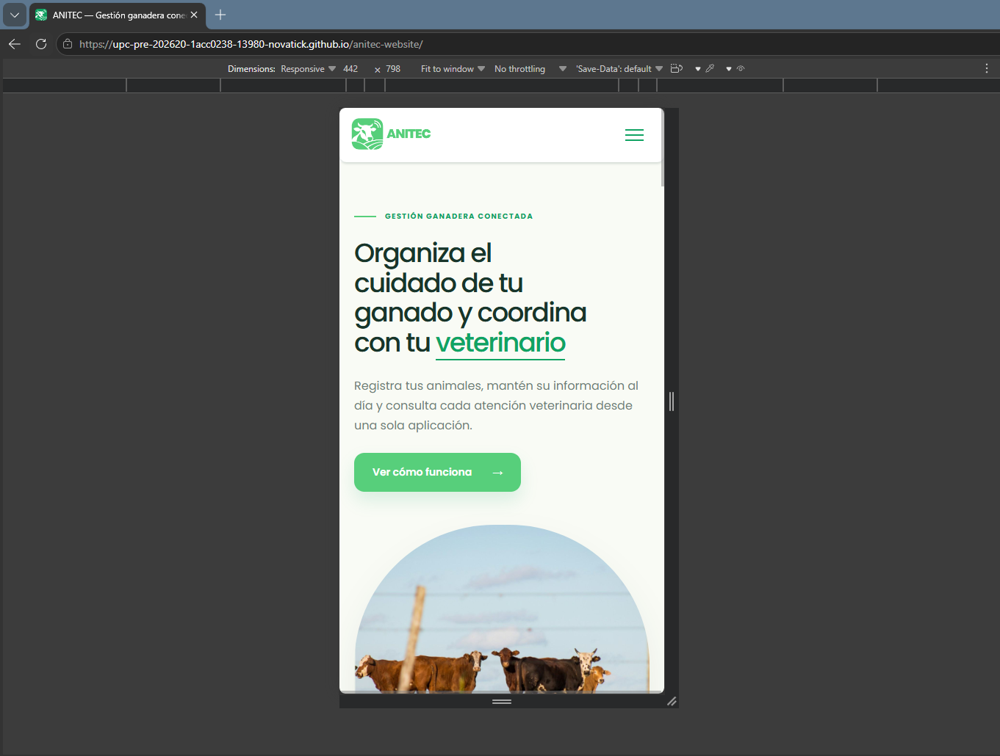

###### Evidencia LP04 - Menú móvil

La captura muestra el menú desplegado con los enlaces a las secciones de la landing page.

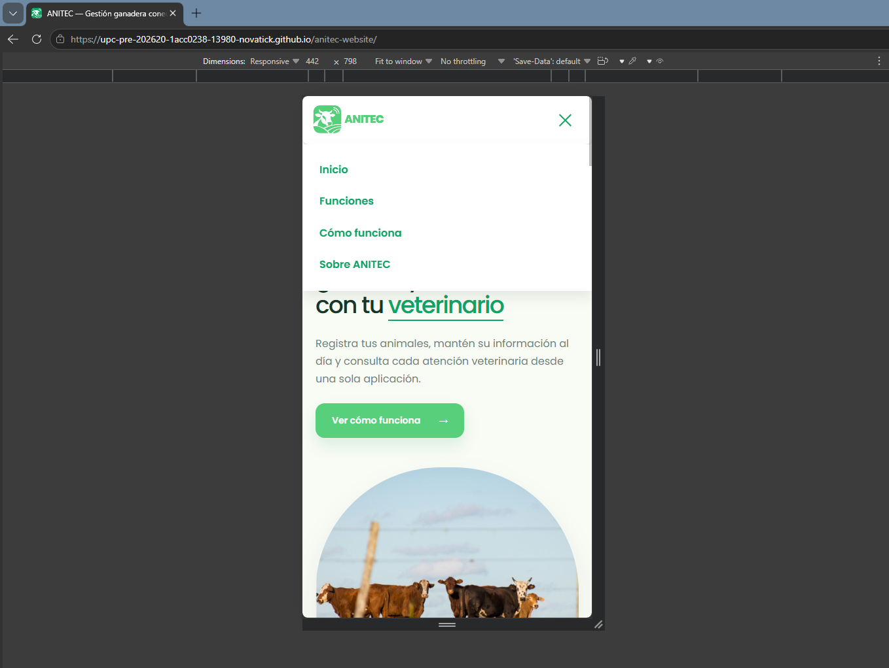

###### Evidencia LP05 - Ventana informativa de contacto

La captura muestra el aviso de contacto, cuyo contenido definitivo permanece pendiente.

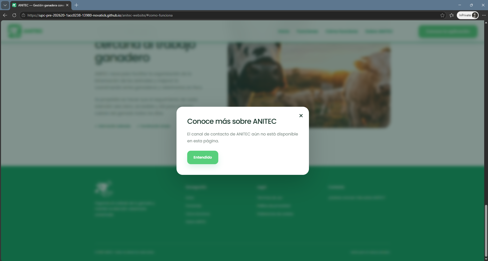

###### Backend

Se realizaron pruebas manuales mediante Swagger en el entorno local, utilizando datos de demostración. Las capturas permiten comprobar los siguientes resultados.

| Código | Prueba                                              | Resultado observado                                                    | Estado   |
| ------ | --------------------------------------------------- | ---------------------------------------------------------------------- | -------- |
| BE01   | Iniciar sesión con credenciales válidas             | Respuesta 200 y mensaje de sesión iniciada.                            | Conforme |
| BE02   | Consultar el inventario de animales                 | Respuesta 200 con el listado de animales.                              | Conforme |
| BE03   | Consultar la ficha de un animal                     | Respuesta 200 con sus datos y registros relacionados.                  | Conforme |
| BE04   | Actualizar los datos de un animal                   | Respuesta 200 y mensaje de animal actualizado.                         | Conforme |
| BE05   | Consultar el catálogo de especies sin autenticación | Respuesta 401 con mensaje de usuario no autenticado o sesión expirada. | Conforme |

###### Evidencia BE01 - Inicio de sesión

La respuesta confirma el inicio de sesión de una cuenta de demostración.

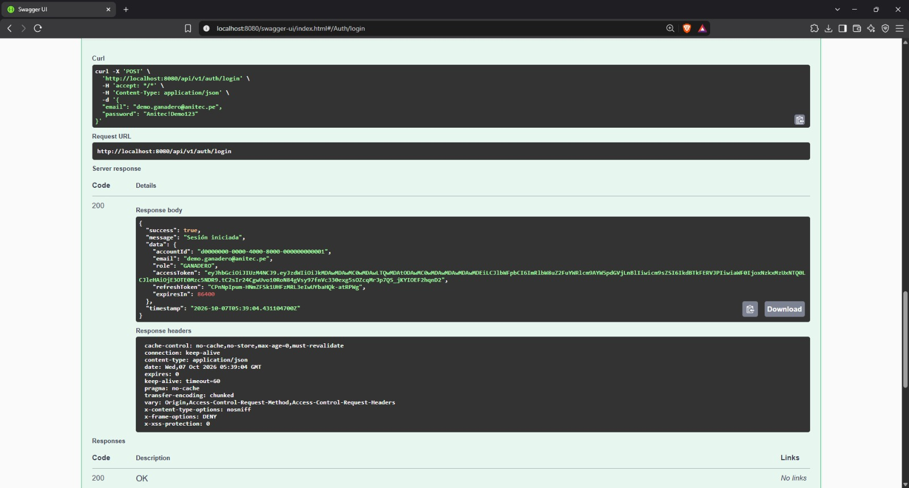

###### Evidencia BE02 - Consulta del inventario

La respuesta muestra los animales del inventario consultado.

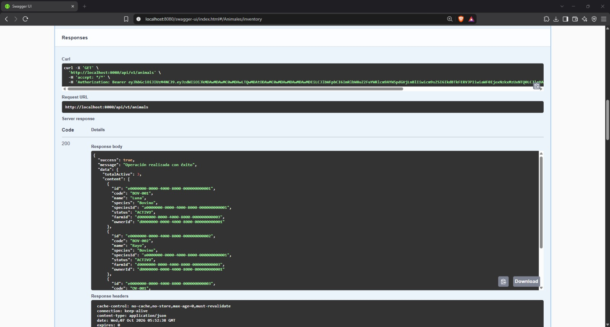

###### Evidencia BE03 - Consulta de la ficha del animal

La respuesta presenta los datos del animal y la información relacionada con sus observaciones y atenciones.

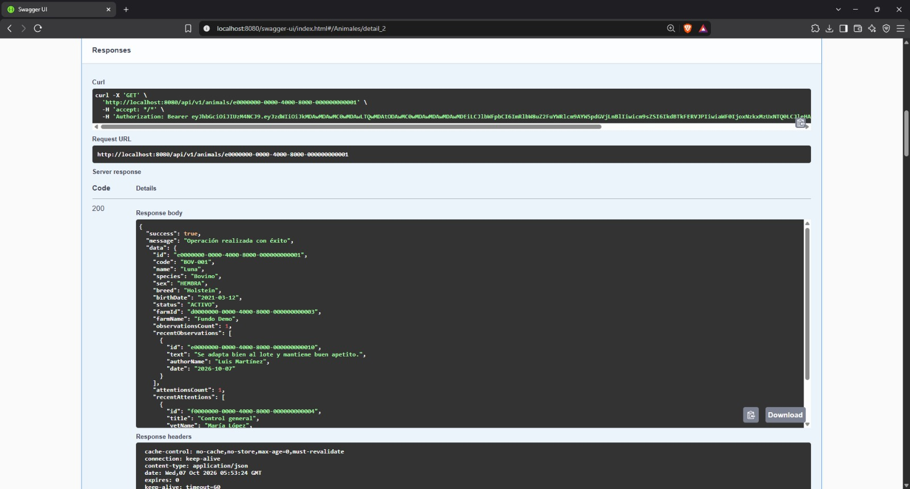

###### Evidencia BE04 - Actualización del animal

La respuesta confirma la actualización y muestra el nombre modificado del animal.

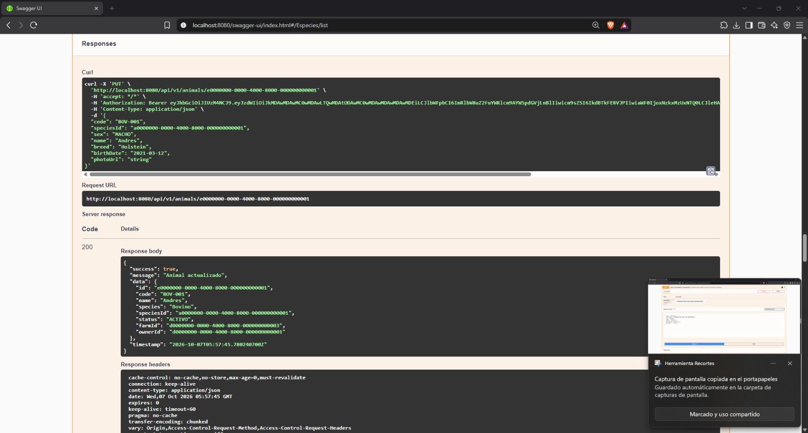

###### Evidencia BE05 - Control de acceso

La solicitud al catálogo de especies se realizó sin autenticación. El backend rechazó la operación con una respuesta 401.

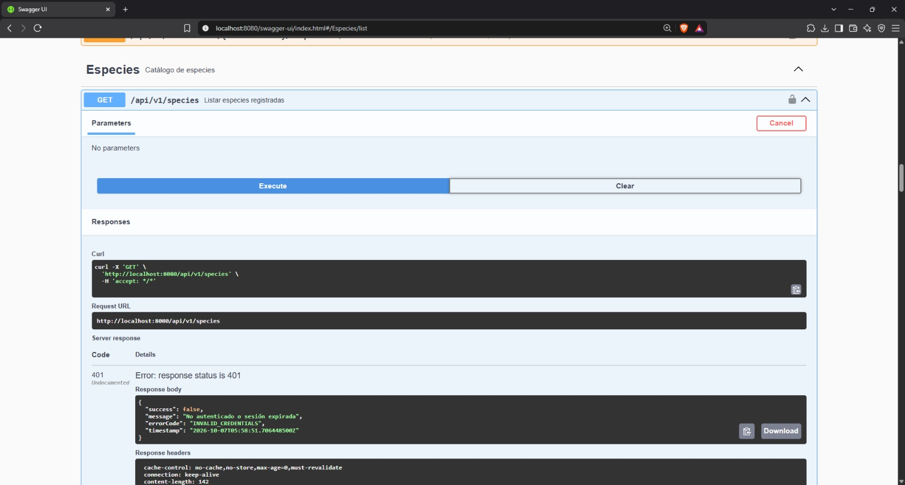

Estas evidencias corresponden a las operaciones indicadas en el entorno local. No comprueban la integración con la aplicación móvil ni el funcionamiento del despliegue público.

##### 4.2.1.6. Execution Evidence for Sprint Review

###### Landing Page

La landing page de ANITEC se encuentra publicada en GitHub Pages. Las capturas del apartado 4.2.1.5 muestran su ejecución en escritorio y vista móvil simulada, la navegación y las ventanas informativas.

Sitio publicado: [ANITEC Landing Page](https://upc-pre-202620-1acc0238-13980-novatick.github.io/anitec-website/)

###### Backend

Las capturas muestran la ejecución del backend en `localhost:8080`. Mediante Swagger se realizaron solicitudes de inicio de sesión, consulta y actualización de animales, además de una comprobación de acceso sin autenticación.

Los resultados se presentan en el apartado 4.2.1.5. La integración con las pantallas móviles permanece pendiente.

##### 4.2.1.7. Services Documentation Evidence for Sprint Review

El backend utiliza Swagger para documentar sus servicios. Esta interfaz permite consultar los métodos HTTP, las rutas, los datos requeridos y las respuestas, además de ejecutar solicitudes de prueba.

Las operaciones se agrupan en autenticación, cuentas, animales, fincas, especies, vinculaciones, invitaciones, visitas, atenciones, suscripciones, notificaciones y administración.

Para el Sprint 1, se consideran principalmente las operaciones de cuentas, sesiones y gestión del inventario. La documentación también incluye operaciones adelantadas de otros sprints.

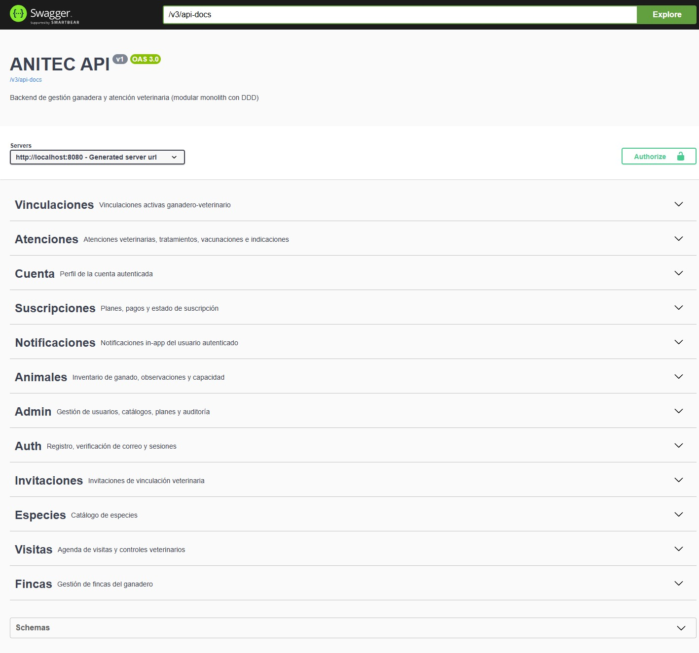

##### 4.2.1.8. Software Deployment Evidence for Sprint Review

###### Landing Page

La landing page se publicó en GitHub Pages. Su contenido está compuesto por archivos estáticos de HTML, CSS, JavaScript e imágenes.

La evidencia LP01 del apartado 4.2.1.5 muestra la página cargada desde su dirección pública.

Sitio desplegado: [ANITEC Landing Page](https://upc-pre-202620-1acc0238-13980-novatick.github.io/anitec-website/)

###### Backend

El despliegue del backend en Render se encuentra en preparación. Al cierre de esta versión del informe, las evidencias disponibles corresponden a la ejecución local.

Queda pendiente incorporar la dirección pública y comprobar las operaciones en el entorno desplegado.

##### 4.2.1.9. Team Collaboration Insights during Sprint

El equipo utiliza GitHub para registrar los cambios del informe y organizar su integración mediante ramas. Las siguientes capturas presentan la actividad del repositorio, las contribuciones registradas y la relación entre las ramas.

###### Actividad del repositorio

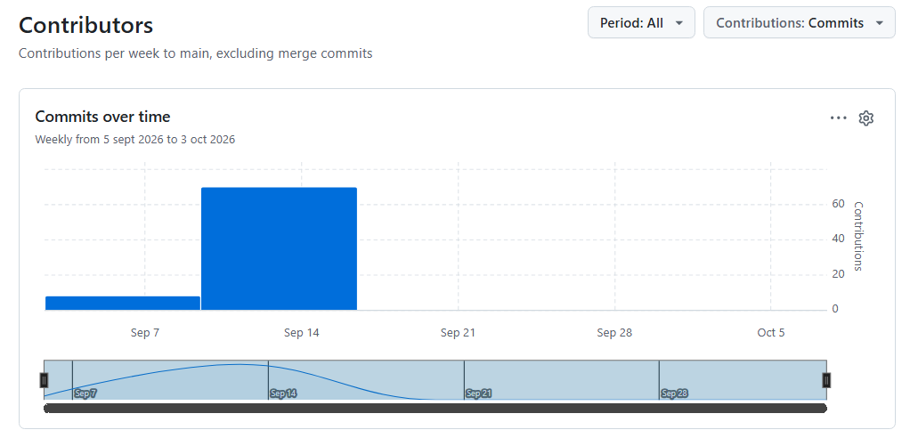

###### Contribuciones por integrante

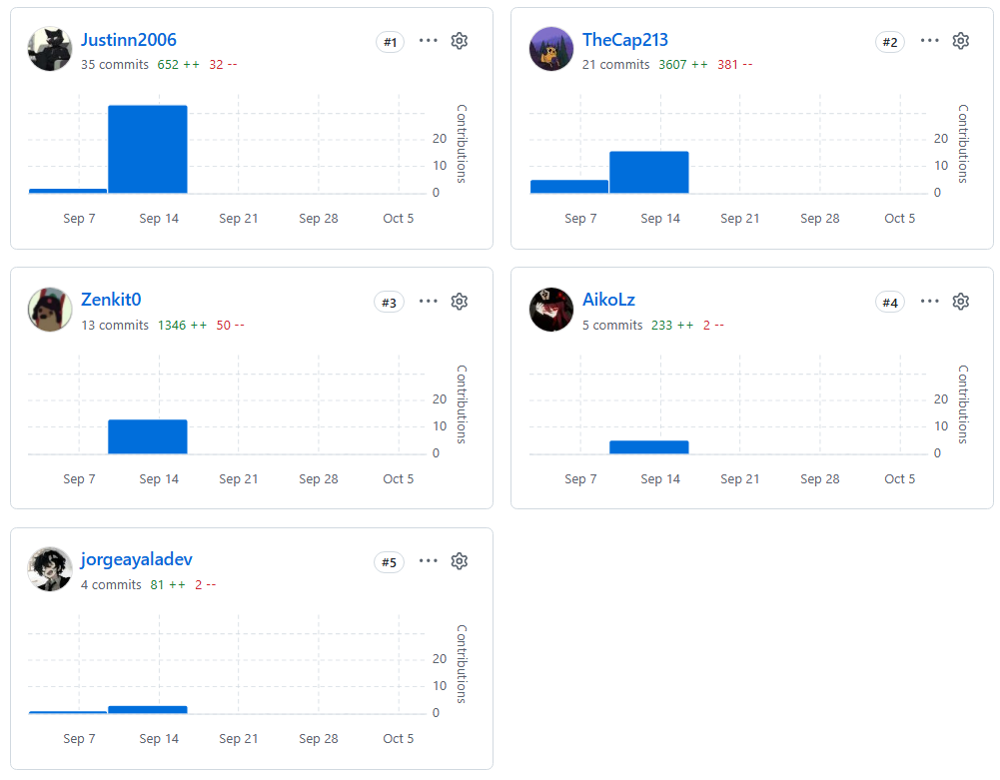

Las estadísticas corresponden a los commits incluidos en la rama main durante el periodo mostrado y excluyen los commits de merge. Por ello, no reflejan todos los cambios pendientes de integrar desde develop ni las contribuciones realizadas en los repositorios de la landing page y el backend.

###### Ramas e integración

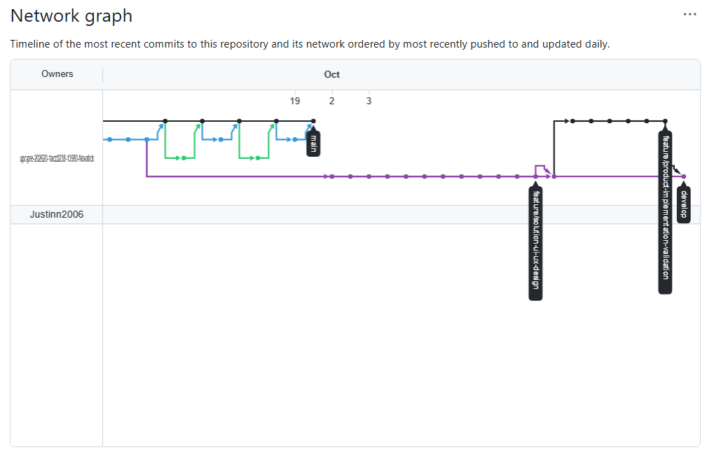

El gráfico presenta la relación entre las ramas de trabajo y las ramas de integración. La cantidad de commits complementa el seguimiento del proyecto, pero no representa por sí sola el esfuerzo o la responsabilidad de cada integrante.

